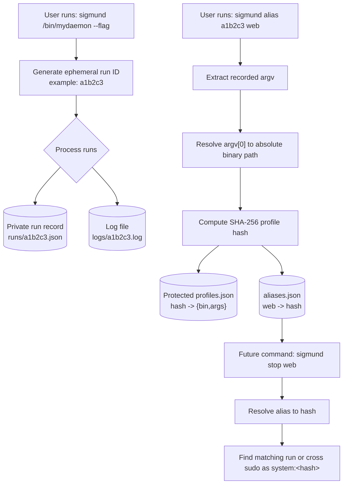
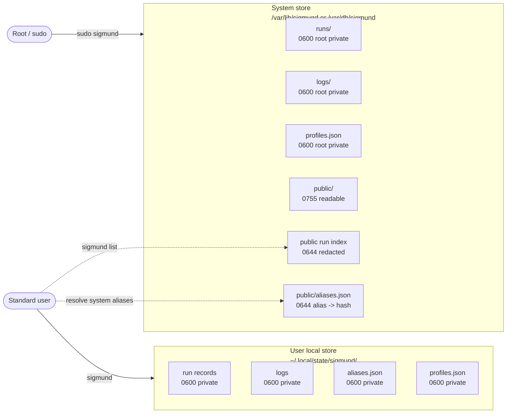
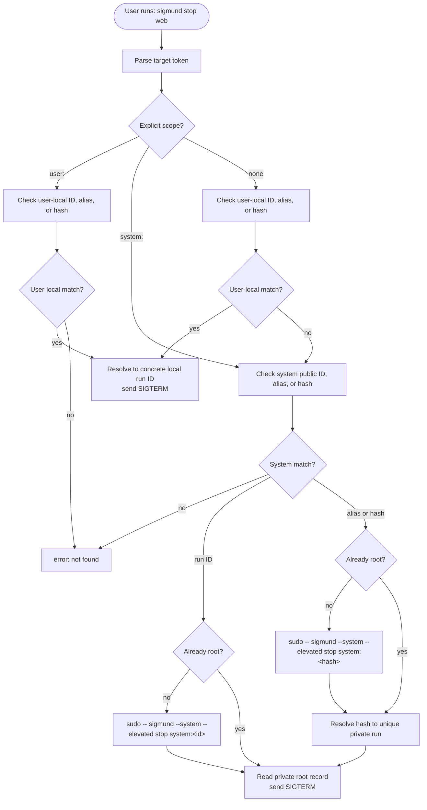

# sigmund

**A tiny, daemonless process launcher and recorder.**

`sigmund` launches commands into a new session / process group, captures their output, records a durable run handle, and lets you safely inspect or stop that tracked process group later. It is designed for CI jobs, integration-test harnesses, local development, and other environments where `nohup cmd &` or `setsid cmd &` leaves too much bookkeeping and too many cleanup footguns behind.

Many CI runners and non-interactive job systems terminate the invoking shell's process group at step completion. `sigmund` escapes that teardown boundary by starting the child in its own session and then recording enough identity information to avoid blindly signaling reused PIDs or unrelated process groups.

*(Name note: in Old English and related Germanic languages, **mund** relates to “protection/guardianship,” so `sigmund` reads naturally as “signal protection.”)*

## Why use `sigmund`?

* **More complete than `setsid`:** you get session isolation plus durable IDs, logs, listing, tailing, pruning, and safe teardown.
* **Better than `nohup &`:** every run has a recorded process group and log, so teardown does not depend on hand-copied PIDs.
* **Safer than bare `kill $PID`:** before signaling, `sigmund` validates boot identity, leader identity, and same-session process-group membership where the platform allows it.
* **Root-aware without changing the normal CLI:** normal runs remain user-local; root or `--system` runs use a universal system store and are discoverable through a redacted public index.
* **Lighter than `systemd-run` or `tmux`:** no daemon, no D-Bus, no service manager dependency.

## Review artifacts

This archive includes durable review artifacts:

- [`CHANGELOG.md`](CHANGELOG.md): file-by-file changes and verification history, including the root-managed state / sudo self-elevation update.
- [`REVIEW.md`](REVIEW.md): review process, rationale, verification commands, and known limitations.
- [`docs/SPEC.md`](docs/SPEC.md): current implementation contract.

## Quickstart

### Build

Requires a C11 compiler and POSIX process APIs. Linux and macOS are supported.

On Linux, `make` attempts to produce a static standalone binary named `sigmund` by default. On macOS, `make` builds a normal dynamically linked Mach-O binary because fully static system linking is not supported there.

```bash
make
./sigmund --help

# Optional on Linux: build a dynamically linked binary instead
make sigmund-dynamic
```

For cross-platform CI and releases, publish the artifact appropriate to each host:

- Linux static artifact (`make`): best portability across Linux hosts.
- Linux dynamic artifact (`make sigmund-dynamic`): smaller binary when runtime libc compatibility is acceptable.
- macOS artifact (`make` on macOS): normal platform-native binary.

### Basic usage

```bash
# Start a user-local tracked process
$ sigmund qemu-system-x86_64 -m 4096 -nographic
sigmund: id=7f3c2a pid=4012 pgid=4012 sid=4012
sigmund: log: /home/alice/.local/state/sigmund/7f3c2a.log
sigmund: stop: sigmund stop 7f3c2a

# List user-local runs plus redacted root-managed public entries
$ sigmund list
RUNID      STATE    STARTED_AT               RESULT         CMD
7f3c2a     running  2026-06-15T18:42:11Z     -              qemu-system-x86_64 -m 4096...

# Stop the run cleanly
$ sigmund stop 7f3c2a
```

Use `sigmund -- <cmd>` when the child command name overlaps with a `sigmund` subcommand.

## Concepts

### Ephemeral to immutable

Normal starts create ephemeral run IDs. `sigmund alias <id> <name>` promotes one recorded command into an immutable profile keyed by a SHA-256 fingerprint of the resolved binary path and exact argv array.



## Real-World Workflows

### 1. CI/CD pipeline integration tests

When integration tests need a database, web server, emulator, or other long-running helper, `sigmund` can start it in one CI step, keep it alive after that step exits, capture its logs, and tear down the full process group later.

```yaml
- name: Start test database
  run: |
    out="$(sigmund -- redis-server --port 6379 2>&1)"
    printf '%s\n' "$out"
    run_id="$(printf '%s\n' "$out" | sed -n 's/^sigmund: id=\([0-9a-f][0-9a-f]*\).*/\1/p')"
    echo "REDIS_RUN_ID=$run_id" >> "$GITHUB_ENV"
    sleep 2

- name: Run integration tests
  run: npm run test:integration

- name: Show database log on failure
  if: failure()
  run: sigmund dump "$REDIS_RUN_ID" || true

- name: Teardown test database
  if: always()
  run: |
    sigmund stop "$REDIS_RUN_ID" || true
    sigmund prune "$REDIS_RUN_ID" || true
```

### 2. Local development stack

For a local app with several cooperating processes, start each one once and keep one terminal free for normal work.

```bash
sigmund npm run dev:frontend
sigmund npm run dev:backend
sigmund celery -A myapp worker

sigmund list
sigmund tail <backend-run-id>

# Later, stop the pieces you started.
sigmund stop <frontend-run-id> <backend-run-id> <worker-run-id>
sigmund prune all
```

### 3. Root-managed helpers

Some test helpers need root privileges or system-visible state. Use `--system` for those runs. Normal users can still see that a root-managed run exists through the redacted public index, while private command details and logs stay root-only.

```bash
sigmund --system qemu-system-x86_64 -m 4096 -nographic

sigmund list
# root-managed rows appear as <root-managed> with STATE unknown

sudo sigmund tail system:<run-id>
sigmund stop system:<run-id>
```

## Storage model

`sigmund` has two storage contexts.

### User-local state

Normal non-root starts write to:

```text
~/.local/state/sigmund
```

User-local records and logs are private to that user:

```text
directory: 0700
records:   0600
logs:      0600
aliases:   0600 aliases.json
profiles:  0600 profiles.json
```

### Root-managed state

Runs started with root authority, through `sudo`, or through `sigmund --system ...` write to a universal system location:

```text
Linux: /var/lib/sigmund
macOS: /var/db/sigmund
```

The system store is split into private and public areas:

```text
/var/lib/sigmund/runs/      private root run records
/var/lib/sigmund/logs/      private root logs
/var/lib/sigmund/profiles.json
/var/lib/sigmund/public/    public redacted discovery index
```

macOS uses the same layout under `/var/db/sigmund`.

Private root records, logs, and profiles are root-owned and require root authority to read. Public index files are user-readable and contain only safe discovery fields: ID, root-managed marker, elevation requirement, non-authoritative state hint, and start time. The public alias dictionary maps alias names to profile hashes only. Public files do **not** expose argv, command display, log paths, PID/PGID/SID, boot identity, executable identity, environment, sudo provenance, or private filesystem paths.

Because there is no daemon continuously refreshing root state, normal `sigmund list` displays root-public rows with `STATE` as `unknown` and never prompts for sudo. Root/private records remain authoritative when root Sigmund evaluates the run, and root logs/private details require running the relevant command through root authority such as `sudo sigmund list`, `sudo sigmund tail <id>`, or `sudo sigmund dump <id>`.

Example normal list containing a redacted root-managed run:

```text
RUNID      STATE    STARTED_AT               RESULT         CMD
7f3c2a     unknown  2026-06-15T18:42:11Z     -              <root-managed>
```



## Root/system mode

`--system` is an invocation switch, not a subcommand and not an ID scope.

```bash
sigmund --system qemu-system-x86_64 -m 4096
sigmund start "qemu-system-x86_64 -m 4096" --system
sudo sigmund qemu-system-x86_64 -m 4096
```

Those forms create root-managed runs. A root/sudo/system start never writes to `/root/.local/state/sigmund` and never writes into the invoking user's local state.

When a non-root action needs root authority, `sigmund` forks a `sudo` child and waits for it using an argv-preserving command shape:

```text
sudo -- /absolute/path/to/sigmund --system --elevated <canonical-command...>
```

There is no shell reconstruction, no `sudo sh -c`, no string command payload, and no quoting layer. `stdin`, `stdout`, and `stderr` are inherited by the sudo/root-Sigmund child so sudo prompts, sudo diagnostics, root Sigmund diagnostics, and streamed logs behave like one foreground command. The non-root parent waits and returns the sudo/root-Sigmund exit status; if `sudo` itself cannot be executed, the child prints a clean diagnostic and exits `127`.

The internal `--elevated` flag is not a user-facing feature. If it appears without effective UID 0, Sigmund fails with an internal error instead of trying to elevate again.

## Command parsing

Sigmund has two command modes.

### Raw start form

```bash
sigmund <cmd...>
```

Only invocation switches before the child command belong to Sigmund:

```bash
sigmund --system qemu-system-x86_64 -m 4096    # --system belongs to Sigmund
sigmund qemu-system-x86_64 -m 4096 --system    # --system belongs to QEMU
```

### Sigmund-owned command form

For known Sigmund commands, invocation switches may appear before or after the owned arguments:

```bash
sigmund --system stop 7f3c2a
sigmund stop 7f3c2a --system
sigmund start "qemu-system-x86_64 -m 4096" --system
```

Known commands include `list`, `stop`, `kill`, `tail`, `dump`, `prune`, `start`, `alias`, `aliases`, `grant`, and `revoke`.

## Command reference

### Start commands

| Command | Description |
|---|---|
| `sigmund <cmd...>` | Starts a command in a new session / process group using user-local state. |
| `sigmund --tail <cmd...>` | Starts a command and immediately follows its log. |
| `sigmund -- <cmd...>` | Starts a command whose name overlaps with a Sigmund subcommand. |
| `sigmund --system <cmd...>` | Self-elevates through sudo when needed and starts a root-managed run. |
| `sigmund start <cmd...>` | Explicit start form; Sigmund-owned switches such as trailing `--system` are parsed by Sigmund. |
| `sigmund start <alias-or-hash>` | Starts an immutable capability profile by alias or profile hash. |

### Management commands

| Command | Description |
|---|---|
| `sigmund list` | Lists user-local runs plus redacted root-managed public rows. Never prompts for sudo. |
| `sigmund tail <id>` | Follows a running log from the end; prints an already-finished/stale/unknown log from the beginning. |
| `sigmund dump <id>` | Prints the saved output log for a run and exits. |
| `sigmund stop <id>` | Sends `SIGTERM` to the tracked process group, waits up to 5 seconds, then sends `SIGKILL` if needed. |
| `sigmund kill <id>` | Immediately sends `SIGKILL` to the tracked process group. |
| `sigmund killcmd <id>` | Prints the raw shell command needed to signal a safely validated user-local process group. |
| `sigmund alias <id> <name>` | Pins a run's binary path and argv as an immutable profile and maps an alias to its SHA-256 hash. |
| `sigmund aliases` | Lists visible aliases and profile hashes. |
| `sigmund grant <alias> <user> [actions]` | Adds root-managed NOPASSWD sudoers entries for `start,stop,kill,tail,dump,prune`; `<user>` may be a username, `%group`, or `all`; omitted actions means all supported Sigmund actions for that alias profile. |
| `sigmund revoke <alias> <user> [actions]` | Removes matching Sigmund-managed sudoers entries; `<user>` may be a username, `%group`, or `all`; omitted actions removes the managed file. |
| `sigmund prune` | Removes exited/failed/stale records and orphan logs. |
| `sigmund prune <id>` | Removes exactly one prunable run record and associated log. |
| `sigmund prune all` | Removes all prunable runs and associated output. |

### Targeting IDs, aliases, and hashes

Plain IDs are the normal interface. Aliases and 64-character profile hashes are also valid in the same target slot for `start`, `stop`, `kill`, `tail`, `dump`, and `prune`.

For rare deterministic conflict cases, explicit ID tokens are supported inside the existing ID slot:

```bash
sigmund stop user:7f3c2a
sigmund stop system:7f3c2a
sigmund start web-test
sigmund stop system:web-test
sudo sigmund stop user:7f3c2a
sudo sigmund stop system:7f3c2a
```

Rules:

- Normal non-root action on a plain target checks user-local state first. If user-local and root-managed public targets share the same name or ID, user-local wins and Sigmund does not self-elevate.
- Normal non-root action on a root-only plain target, or on `system:<target>`, self-elevates for `stop`, `kill`, `prune`, `tail`, and `dump`.
- Root/sudo action on a plain target checks root-managed private state first, then the invoking user's local state when sudo provenance exists. In a conflict, root-managed wins.
- `user:<target>` never targets root-managed state. `system:<target>` never targets user-local state.
- When a root-managed alias crosses the sudo boundary, Sigmund canonicalizes it to `system:<hash>`, not `system:<alias>`, so sudoers can grant authority to an immutable command fingerprint.



### Alias profiles

`sigmund alias <id> <name>` reads the target run's recorded argv, resolves argv[0] to an absolute binary path, computes a SHA-256 profile hash, stores the protected profile, and writes `name -> hash` into `aliases.json`.

The protected profile map is `profiles.json`:

```json
{
  "fb736e64274bb2fd4861ff5d239288d4abc74aa3ae233b733b6201da507868ee": {
    "bin": "/usr/bin/redis-server",
    "args": ["redis-server", "/etc/redis.conf"]
  }
}
```

The hash is over a versioned, NUL-delimited byte stream containing the resolved binary path, exact argv order, and an empty environment count. Environment capture is intentionally not included yet, because current run records do not store environment and many environments contain secrets.

`sigmund grant <alias> <user> [actions]` writes an alias/user-specific sudoers template such as `/etc/sudoers.d/sigmund_web-test_alice`. The `<user>` argument may be a username, `%group`, or `all`. The alias is resolved to its immutable profile hash before writing, so the generated file contains exact `sigmund --system --elevated <action> system:<hash>` command lines rather than the mutable alias name. Omitted actions expand to all supported Sigmund actions for that alias profile (`start,stop,kill,tail,dump,prune`), not arbitrary sudo access.

## Stdio and logging

Child process output is captured:

* child `stdin` is redirected from `/dev/null`;
* child `stdout` and `stderr` are redirected to the per-run log file;
* start output includes the run ID, process identity, log path, and stop command.

`sigmund --tail <cmd...>` starts a command and follows its log immediately. `sigmund tail <id>` follows the log of an existing running process, or prints finished/stale/unknown logs from the beginning. Press Ctrl-C to detach from tailing while the background process keeps running.

Action-command self-elevation does **not** pipe or capture terminal I/O. The `sudo`/root-Sigmund child inherits the original terminal descriptors so password prompts, diagnostics, Ctrl-C behavior, and root-side output are preserved, while the non-root parent waits and returns the child status.

## Architecture and safety guarantees

State updates use atomic temp-file writes, `fsync()`, and `rename()` so records are not left half-written during power loss or interruption.

```mermaid
sequenceDiagram
    participant Shell as Caller shell
    participant Parent as Sigmund parent
    participant Child as Sigmund child
    participant Target as Target process

    Shell->>Parent: exec sigmund <cmd>
    Parent->>Parent: create O_CLOEXEC handshake pipe
    Parent->>Child: fork()

    rect rgb(40, 44, 52)
        Note right of Child: child preparation
        Child->>Child: setsid()
        Child->>Child: redirect stdin to /dev/null
        Child->>Child: redirect stdout/stderr to log
        Child->>Target: execvp(cmd) or execv(profile bin)
    end

    alt exec succeeds
        Target-->>Parent: handshake pipe closes on exec
        Parent->>Parent: write run record and public index if system
        Parent-->>Shell: print run ID and exit 0
        Note over Target: target survives caller shell exit
    else exec fails
        Child-->>Parent: write errno through pipe
        Parent->>Parent: rollback reservation, log, and process group
        Parent-->>Shell: print error and exit 1
    end
```



Before sending a signal, Sigmund checks:

1. Whether the current boot marker matches the recorded one when available. Linux uses `/proc/sys/kernel/random/boot_id`; macOS uses `kern.boottime`.
2. Whether the leader process identity still matches. Linux checks `/proc/<pid>/stat` start time and, when available, `/proc/<pid>/exe` device/inode. macOS checks kernel process start time and best-effort executable path device/inode.
3. If the leader PID has exited but the process group still has members, whether those members still belong to the recorded session.

If a boot or identity check fails, the state evaluates as `stale` and signals are blocked. If the operating system cannot provide enough information to validate a target safely, the state evaluates as `unknown` and signaling commands refuse it. Stale and unknown records remain visible until explicitly pruned.

`sigmund` does **not** restart processes after reboot and is **not** a supervisor.

## Test notes

`make test` builds with `-DSIGMUND_TESTING` and uses a test-only `SIGMUND_TEST_SYSTEM_STATE_DIR` override. Production builds do not honor an arbitrary environment variable for the system store.

The test harness creates explicit actors:

```text
USER_ACTOR = non-root Sigmund context
ROOT_ACTOR = direct root/system Sigmund context
SUDO_ACTOR = root Sigmund with sudo provenance for the user actor
```

This keeps tests independent of whether the test runner itself starts as root or non-root.

## License

Apache-2.0. See `LICENSE`.
