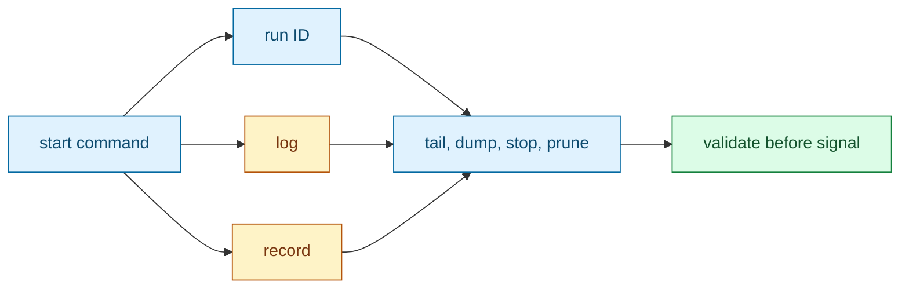

# sigmund

**A tiny, daemonless process launcher and recorder.**

`sigmund` starts a command, gives you a durable run ID, captures its output, and lets you inspect or stop the recorded process group later. It is for CI jobs, integration-test harnesses, local development stacks, and any place where `nohup cmd &`, `setsid cmd &`, or hand-managed PID files are too fragile.

The short version:

```bash
run_id="$(sigmund ./your-server --port 9000)"
sigmund tail "$run_id"
sigmund stop "$run_id"
```

## Install

One-line installer for supported release targets:

```sh
curl -LsSf https://github.com/RchGrav/sigmund/releases/latest/download/install.sh | sh
```

The installer uses `/usr/local/bin/sigmund` when it can write there, and otherwise falls back to `$HOME/.local/bin/sigmund`. If the install directory is not on your current `PATH`, the installer prints the export command and still tells you the absolute binary path.

To force a system install, use `--system`; the installer prompts through `sudo` only if it cannot write `/usr/local/bin` directly:

```sh
curl -LsSf https://github.com/RchGrav/sigmund/releases/latest/download/install.sh | sh -s -- --system
```

For scripts and CI, ask the installer to write an environment handoff file:

```sh
curl -LsSf https://github.com/RchGrav/sigmund/releases/latest/download/install.sh |
  SIGMUND_ENV_FILE="$PWD/.sigmund-env" sh
. "$PWD/.sigmund-env"

"$SIGMUND_BIN" --version
```

More install modes and platform-selection details are in [Installing Sigmund](docs/install.md).

## Why Sigmund?

- It keeps helper processes alive after the shell or CI step that launched them exits.
- It records a run ID, log, and process-group identity for later management.
- It stops the recorded process group instead of relying on a hand-copied PID.
- It refuses unsafe signals when the recorded process identity is stale or unclear.
- It stays small: no daemon, no service manager, no D-Bus, no session multiplexer.



## First Run

Build it:

```bash
make
./sigmund --help
```

Start something:

```bash
run_id="$(./sigmund python3 -m http.server 8765)"
```

Look at it:

```bash
./sigmund list
./sigmund dump "$run_id"
```

Stop it:

```bash
./sigmund stop "$run_id"
./sigmund prune "$run_id"
```

That is the core workflow. The [quickstart](docs/quickstart.md) walks through this path step by step, including automatic choices, deterministic targeting, aliases, root-scoped delegation, and CI usage.

## Common Workflows

**CI helper process**

```yaml
- name: Start helper
  run: |
    run_id="$(./sigmund ./your-server --port 9000)"
    echo "HELPER_RUN_ID=$run_id" >> "$GITHUB_ENV"

- name: Run tests
  run: ./run-tests

- name: Show helper log on failure
  if: failure()
  run: ./sigmund dump "$HELPER_RUN_ID" || true

- name: Stop helper
  if: always()
  run: ./sigmund stop "$HELPER_RUN_ID" || true
```

More CI examples live in [Using Sigmund in CI](docs/ci.md).

**Local development stack**

```bash
frontend_id="$(sigmund npm run dev:frontend)"
backend_id="$(sigmund npm run dev:backend)"

sigmund list
sigmund tail "$backend_id"
sigmund stop "$frontend_id" "$backend_id"
```

**Reusable aliases**

```bash
id="$(sigmund ./your-server --port 9000)"
sigmund alias "$id" web
sigmund start web
sigmund stop web
```

Aliases and root-managed profiles are explained in [Profiles and aliases](docs/profiles-and-aliases.md).

## Command Surface

Most users only need this small set:

| Goal | Command |
| --- | --- |
| Start a command | `sigmund <cmd...>` |
| List visible runs | `sigmund list` |
| Follow output | `sigmund tail <id-or-alias>` |
| Print saved output | `sigmund dump <id-or-alias>` |
| Stop a run | `sigmund stop <id-or-alias>` |
| Remove finished state | `sigmund prune <id-or-alias>` |
| Save a command as a name | `sigmund alias <id> <name>` |
| Start a saved command | `sigmund start <name>` |

Advanced command forms, parser rules, exit codes, targeting rules, console mode, root/system behavior, and grant/revoke are documented in the [technical reference loop](docs/index.md#technical-reference-loop).

## Documentation Map

Start here:

- [Installing Sigmund](docs/install.md): one-line install, CI handoff, platform detection, and checksums.
- [Quickstart](docs/quickstart.md): the guided onboarding loop.
- [Using Sigmund in CI](docs/ci.md): copyable CI recipes and workflow examples.
- [Examples](examples/README.md): runnable scripts, including a Sigmund + uv alias demo.
- [Documentation index](docs/index.md): the two-layer navigation model.

Go deeper:

- [Launcher](docs/launcher.md): how commands start and become recorded runs.
- [Store](docs/store.md): where run IDs, logs, aliases, and public hints live.
- [Identity and validation](docs/identity.md): why Sigmund validates before signaling.
- [Target resolution](docs/target-resolution.md): IDs, aliases, `user:`, `system:`, and ambiguity.
- [Profiles and aliases](docs/profiles-and-aliases.md): reusable launch recipes and profile hashes.
- [Security and privilege boundaries](docs/security.md): root-managed runs, sudo, grants, and redaction.
- [Console](docs/console.md): optional attachable PTY sessions.
- [CLI contract](docs/cli-contract.md): stdout/stderr behavior, flags, and exit codes.
- [Specification](docs/SPEC.md): current implementation contract.

## Build Notes

Requires a C11 compiler and POSIX process APIs. Linux and macOS are supported.

On Linux, `make` attempts to produce a static standalone binary named `sigmund` by default. On macOS, `make` builds a normal dynamically linked Mach-O binary because fully static system linking is not supported there.

```bash
make

# Optional on Linux: build a dynamically linked binary instead.
make sigmund-dynamic
```

## What Sigmund Is Not

Sigmund is not a service supervisor. It does not restart processes after reboot, keep a resident daemon, or continuously refresh state in the background. It records enough information at launch to make later inspection and cleanup safer.

## License

Apache-2.0. See [LICENSE](LICENSE).
