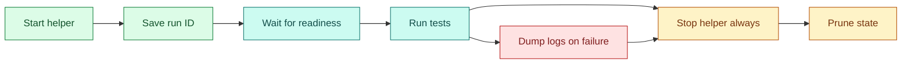

# Using On Hold in CI

[Docs index](index.md) | [Quickstart](quickstart.md) | [Previous: CLI contract](cli-contract.md) | [Loop: Index](index.md) | Related: [Launcher](launcher.md), [Identity](identity.md)

Outer loop bridge: deep dive for quickstart Step 7, Use It In CI.

On Hold is useful in CI when one step needs to start a long-running helper and later steps need to inspect or stop it. Examples include databases, web servers, emulators, local object stores, test daemons, and language-specific dev servers. It gives CI scripts a durable run ID, a log, and safe process-group teardown without bringing in `tmux`, `systemd`, a custom supervisor, or hand-managed PID files.

The important CI contract is simple:

- `hold <cmd...>` starts the helper detached from the shell's process group.
- stdout is only the run ID, so scripts can capture it directly.
- stderr contains human status such as the log path and stop command.
- `hold dump <id>` prints the saved log and exits.
- `hold stop <id>` validates the recorded process group, sends `SIGTERM`, then escalates to `SIGKILL` if needed.
- `hold prune <id>` removes past run state after teardown.

## Install in CI

Use the installer handoff file when a workflow needs to install On Hold and use it in later commands without relying on shell startup files:

```yaml
- name: Install On Hold
  shell: bash
  run: |
    set -Eeuo pipefail
    curl -LsSf https://github.com/RchGrav/hold/releases/latest/download/install.sh |
      HOLD_INSTALL_DIR="$PWD/.bin" \
      HOLD_ENV_FILE="$PWD/.hold-env" \
      sh
    cat "$PWD/.hold-env" >> "$GITHUB_ENV"

- name: Check On Hold
  shell: bash
  run: |
    "$HOLD_BIN" --version
```

`HOLD_INSTALL_DIR` chooses a job-local install directory. `HOLD_ENV_FILE` tells the installer to write `HOLD_BIN` and a matching `PATH` update for later steps. Appending that file to `$GITHUB_ENV` makes both values available to the rest of the job.

For a runnable shell example that installs On Hold and uv, starts a web server, creates a durable profile, and restarts that profile from another directory, see [examples/uv-webserver-profile.sh](../examples/uv-webserver-profile.sh).

## Recipes

### Start a helper in one step and use it later

This is the basic CI problem: a shell step exits, but the helper should keep running for later steps.

```yaml
- name: Start API
  shell: bash
  run: |
    set -Eeuo pipefail
    api_id="$("$HOLD_BIN" npm run start:api)"
    echo "API_RUN_ID=$api_id" >> "$GITHUB_ENV"

- name: Test against API
  shell: bash
  run: |
    set -Eeuo pipefail
    curl -fsS http://127.0.0.1:3000/health
    npm run test:integration
```

Benefit: the later step gets a stable On Hold run ID instead of relying on `$!`, which died with the shell that launched it.

### Show logs only when tests fail

```yaml
- name: Dump API log on failure
  if: failure()
  shell: bash
  run: |
    "$HOLD_BIN" dump "$API_RUN_ID" || true
```

Benefit: logs are captured from the file On Hold created at launch, so you do not need to redirect output by hand or keep a background `tail` alive.

### Always stop the whole process group

```yaml
- name: Stop API
  if: always()
  shell: bash
  run: |
    set +e
    "$HOLD_BIN" stop "$API_RUN_ID"
    stop_rc=$?
    "$HOLD_BIN" prune "$API_RUN_ID" || true
    exit "$stop_rc"
```

Benefit: On Hold signals the recorded process group after validation. This is safer than `kill "$pid"` and catches child processes that a shell wrapper may have spawned.

### Start multiple helpers and tear them down together

```bash
api_id="$(hold npm run start:api)"
worker_id="$(hold npm run start:worker)"
redis_id="$(hold redis-server --port 6379)"

hold stop "$api_id" "$worker_id" "$redis_id"
hold prune "$api_id" || true
hold prune "$worker_id" || true
hold prune "$redis_id" || true
```

Benefit: each helper has its own run ID and log, while `stop` can still tear down several recorded process groups in one command.

### Keep a live log open for a long smoke test

Use `tail` when a CI step is intentionally a live monitor:

```bash
run_id="$(hold ./long-running-smoke-server)"
hold tail "$run_id" &
tail_pid=$!

./run-smoke-tests
test_rc=$?

kill "$tail_pid" 2>/dev/null || true
hold stop "$run_id" || true
hold prune "$run_id" || true
exit "$test_rc"
```

Benefit: `tail` follows the recorded log without becoming the owner of the helper process. Stopping the tail does not stop the run.

### Print the underlying signal command for debugging

```bash
hold stop --print "$API_RUN_ID"
```

Benefit: this validates the record and prints the process-group signal command On Hold would use, which is useful when debugging CI cleanup behavior.

### Use a root-managed helper only when needed

```yaml
- name: Start root-managed helper
  shell: bash
  run: |
    run_id="$(./hold --system ./needs-root-managed-state --flag)"
    echo "ROOT_HELPER_RUN_ID=$run_id" >> "$GITHUB_ENV"

- name: Stop root-managed helper
  if: always()
  shell: bash
  run: |
    ./hold stop "system:$ROOT_HELPER_RUN_ID" || true
```

Benefit: root-managed runs are discoverable through the public redacted index while private command details and logs remain root-only. Use this only when the helper really belongs in system state.

## Basic Pattern



The key is to save the run ID somewhere the later CI steps can read. In GitHub Actions, use `$GITHUB_ENV` or `$GITHUB_OUTPUT`. In other CI systems, use their environment-file, artifact, workspace file, or step-output mechanism.

## Full GitHub Actions Example

This workflow starts a Python HTTP server, waits until it is reachable, runs checks, dumps logs on failure, and always stops the process group.

```yaml
name: integration

on:
  push:
  pull_request:

jobs:
  integration:
    runs-on: ubuntu-latest

    steps:
      - uses: actions/checkout@v4

      - name: Install On Hold
        shell: bash
        run: |
          set -Eeuo pipefail
          curl -LsSf https://github.com/RchGrav/hold/releases/latest/download/install.sh |
            HOLD_INSTALL_DIR="$PWD/.bin" \
            HOLD_ENV_FILE="$PWD/.hold-env" \
            sh
          cat "$PWD/.hold-env" >> "$GITHUB_ENV"

      - name: Start web helper
        shell: bash
        run: |
          set -Eeuo pipefail
          run_id="$("$HOLD_BIN" python3 -m http.server 8765)"
          echo "WEB_RUN_ID=$run_id" >> "$GITHUB_ENV"

      - name: Wait for web helper
        shell: bash
        run: |
          set -Eeuo pipefail
          for i in $(seq 1 30); do
            if curl -fsS http://127.0.0.1:8765/ >/dev/null; then
              exit 0
            fi
            sleep 1
          done
          "$HOLD_BIN" dump "$WEB_RUN_ID" || true
          exit 1

      - name: Run integration tests
        shell: bash
        run: |
          set -Eeuo pipefail
          curl -fsS http://127.0.0.1:8765/ >/dev/null
          # Replace this with your real test command.
          # npm run test:integration

      - name: Show helper log on failure
        if: failure()
        shell: bash
        run: |
          "$HOLD_BIN" dump "$WEB_RUN_ID" || true

      - name: Stop helper
        if: always()
        shell: bash
        run: |
          set +e
          "$HOLD_BIN" stop "$WEB_RUN_ID"
          stop_rc=$?
          "$HOLD_BIN" prune "$WEB_RUN_ID" || true
          exit "$stop_rc"
```

This example does not use `tail` because CI jobs usually need finite steps. `dump` is the better failure path because it prints the current log and exits. Use `tail` in CI only when you intentionally want a live log-following step.

## Generic Shell Template

Use this shape in any CI system that runs POSIX shell:

```bash
set -Eeuo pipefail
HOLD_BIN="${HOLD_BIN:-hold}"

run_id="$("$HOLD_BIN" ./your-server --port 9000)"
printf '%s\n' "$run_id" > .hold-your-server-id

cleanup() {
  rc=$?
  if [ "$rc" -ne 0 ]; then
    "$HOLD_BIN" dump "$run_id" || true
  fi
  "$HOLD_BIN" stop "$run_id" || true
  "$HOLD_BIN" prune "$run_id" || true
  exit "$rc"
}
trap cleanup EXIT

for i in $(seq 1 60); do
  if curl -fsS http://127.0.0.1:9000/health >/dev/null; then
    break
  fi
  sleep 1
done

./run-your-tests
```

This keeps the run ID in a shell variable for same-step tests and in a file if a later step needs it. If your CI runs each step in a fresh shell, write the ID to the CI system's supported output mechanism too.

## Multiple Helpers

Start each service separately and stop each ID during teardown:

```bash
HOLD_BIN="${HOLD_BIN:-hold}"

api_id="$("$HOLD_BIN" npm run start:api)"
worker_id="$("$HOLD_BIN" npm run start:worker)"
redis_id="$("$HOLD_BIN" redis-server --port 6379)"

cleanup() {
  rc=$?
  [ "$rc" -eq 0 ] || {
    "$HOLD_BIN" dump "$api_id" || true
    "$HOLD_BIN" dump "$worker_id" || true
    "$HOLD_BIN" dump "$redis_id" || true
  }
  "$HOLD_BIN" stop "$api_id" "$worker_id" "$redis_id" || true
  "$HOLD_BIN" prune "$api_id" || true
  "$HOLD_BIN" prune "$worker_id" || true
  "$HOLD_BIN" prune "$redis_id" || true
  exit "$rc"
}
trap cleanup EXIT
```

`stop` accepts multiple targets. `prune` is shown one ID at a time because that makes cleanup diagnostics easier to read in CI logs.

## Exit-Code Handling

For strict teardown, handle important `stop` statuses explicitly:

```bash
hold stop "$run_id"
stop_rc=$?
case "$stop_rc" in
  0)
    ;;
  2)
    echo "On Hold refused to signal because the run could not be validated" >&2
    ;;
  5)
    echo "No recorded run matched $run_id" >&2
    ;;
  *)
    echo "hold stop failed with exit code $stop_rc" >&2
    ;;
esac
exit "$stop_rc"
```

Exit code 2 matters in CI. It means On Hold protected you from signaling a process group it could not prove was still the one it started. That is a test infrastructure problem worth surfacing, not a cleanup detail to hide.

## Root-Managed Helpers

Use `--system` only when the helper really needs root-managed state:

```bash
run_id="$(hold --system ./root-helper --flag)"
echo "ROOT_HELPER_RUN_ID=$run_id" >> "$GITHUB_ENV"
```

Later commands such as `hold stop system:<id>` may self-elevate through sudo when the public root index can identify the target. Normal user-local runs do not need `--system`, and user-local matches win over root-public collisions.

## What to Avoid

- Do not parse the human start banner. Capture stdout for the run ID.
- Do not use `tail` where a finite `dump` is enough.
- Do not ignore exit code 2 from `stop`; it is On Hold's safety refusal.
- Do not use `--system` just to make a run visible. Use it only for root-managed helpers.
- Do not assume a public root row is authoritative liveness. Root/private validation happens when the action runs.

## Implementation map

For maintainers, the primary functions are `perform_start`, `cmd_dump_action`, `cmd_signal_action`, `do_signal_action`, `cmd_prune_action`, `help_scripting`, and `main`.

## Continue

[Finish after Step 7](index.md) | [Back to docs index](index.md) | [Top](#using-hold-in-ci) | [Loop to start](index.md) | Branch to: [CLI contract](cli-contract.md), [Launcher](launcher.md), [Identity](identity.md)
