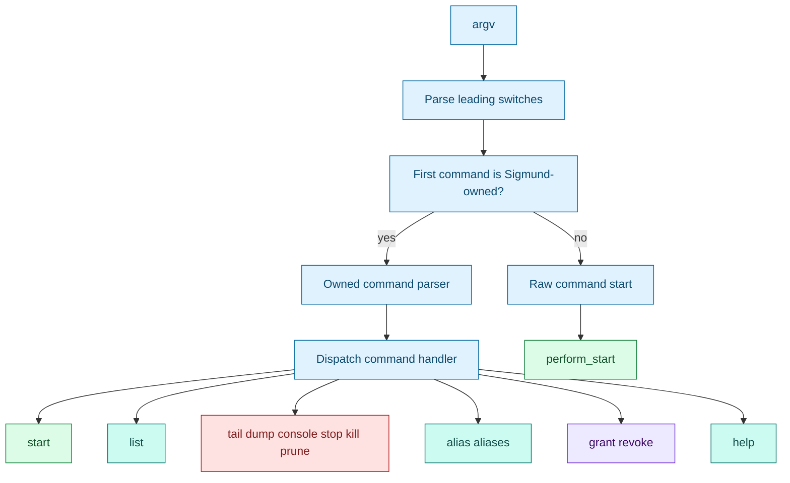

# CLI contract

[Docs index](index.md) | [Quickstart](quickstart.md) | [Previous: Console](console.md) | [Next: Using Sigmund in CI](ci.md) | Related: [Launcher](launcher.md), [Target resolution](target-resolution.md)

Outer loop bridge: this is the deep dive for [Step 2: Manage It Later](quickstart.md#step-2-manage-it-later), [Step 3: Understand Automatic Choices](quickstart.md#step-3-understand-automatic-choices), and [Step 7: Use It In CI](quickstart.md#step-7-use-it-in-ci).

This page is for people writing scripts around Sigmund. It explains what goes to stdout, what goes to stderr, which flags belong to Sigmund, which flags belong to the child command, and how exit codes should be treated.

The most important rule for scripts is that stdout carries machine data and stderr carries human status or diagnostics.

## Parser shape



Leading invocation switches include `--system`, `--elevated`, `--tail`/`-f`, `--console`, `--quiet`, and `--`. Once raw command parsing begins, remaining arguments belong to the child. In owned-command mode, Sigmund continues parsing command-specific switches until a literal `--` marks the rest as owned command arguments.

Known owned commands are `list`, `stop`, `kill`, `tail`, `dump`, `prune`, `console`, `start`, `alias`, `aliases`, `grant`, `revoke`, and `help`.

## Starts

Raw starts:

```bash
sigmund <command> [args...]
sigmund --system <command> [args...]
sigmund --console <command> [args...]
sigmund -f <command> [args...]
sigmund -- <command-that-looks-like-sigmund-action> [args...]
```

Owned starts:

```bash
sigmund start <alias>
sigmund start <alias> --multi
sigmund start <alias> --multi 3
sigmund start <alias> --multi=3
sigmund start <alias> --console
sigmund start <cmd> [args...]
```

A successful start prints only the run ID to stdout before any followed log bytes. The human banner with the command, log path, tail command, optional console command, and stop command goes to stderr and is suppressed by `--quiet`.

## Listing

`sigmund list [alias]` shows visible runs. Normal users see their private user-local runs plus redacted root public rows. Root sees authoritative private system records. `--iso` and `-l` select ISO time formatting.

Normal list does not self-elevate. Root-public rows are discovery data and can show `unknown` state because the public index is not continuously refreshed.

## Action commands

Action commands are:

```text
tail
dump
console
stop
kill
prune
```

They resolve targets through `resolve_action_token`. `stop` sends `SIGTERM`, waits, and escalates to `SIGKILL` if needed. `kill` sends `SIGKILL`. `tail` follows a log and continues while the run is evaluated as running. `dump` prints the current log and exits. `console` attaches to a console-enabled run. `prune` removes past run data and related artifacts.

`stop --print <id>` and `kill --print <id>` print the equivalent `kill` command after validation. `--all` is accepted for target commands but only resolves alias ambiguity for `stop`, `kill`, and `prune`.

## Exit codes

The help text defines this contract:

| Code | Meaning |
| --- | --- |
| 0 | Success, including a known alias with nothing to do. |
| 1 | Usage or generic error. |
| 2 | Refused for safety. |
| 3 | Permission denied or storage/security failure. |
| 4 | Signal delivery failed. |
| 5 | Target not found or invalid target. |
| 6 | Must disambiguate. |

Some lower-level failures exit through `die_errno`, which prints a diagnostic and exits with code 1. Sudo self-elevation returns the child/root Sigmund exit status when sudo successfully starts it, or sudo's own failure status when sudo denies, cancels, or cannot authenticate.

## Aliases and access commands

`sigmund alias <id> <name> [-v]` pins a recorded command as an alias. `sigmund aliases [-v]` lists visible aliases; user aliases show commands, while system aliases show `<root-managed>` and a profile hash display.

`sigmund grant <alias> <user> [actions]` and `sigmund revoke <alias> <user> [actions]` require root authority. Valid actions are `start`, `stop`, `kill`, `tail`, `dump`, `prune`, and `console`. If actions are omitted, all supported actions are selected.

## Why this design works

The parser protects the raw-command use case while still giving Sigmund a structured management interface. That is important for the single-binary constraint: scripts can start arbitrary commands without config files, and management commands can still canonicalize targets for sudo and validation.

The stdout/stderr split exists because detached starts are commonly used in CI. A script can capture `run_id="$(sigmund ...)"` without scraping banners, while humans still get useful context on stderr.

## Implementation map

For maintainers, the primary functions are `main`, `usage`, `show_help`, `help_profiles`, `help_targets`, `help_access`, `help_system`, `help_scripting`, `help_console`, `help_action`, `is_sigmund_owned_command`, `command_accepts_target_tokens`, `cmd_start_action`, `cmd_list_normal`, `cmd_list_system`, `cmd_signal_action`, `cmd_tail_action`, `cmd_dump_action`, `cmd_console_action`, `cmd_prune_action`, `cmd_alias_action`, `cmd_aliases_action`, and `cmd_grant_revoke_action`.

## Continue

[Back to Step 2](quickstart.md#step-2-manage-it-later) | [Back to Step 3](quickstart.md#step-3-understand-automatic-choices) | [Back to Step 7](quickstart.md#step-7-use-it-in-ci) | [Back to docs index](index.md) | [Top](#cli-contract) | [Next: Using Sigmund in CI](ci.md) | Branch to: [Launcher](launcher.md), [Target resolution](target-resolution.md), [Security](security.md)
