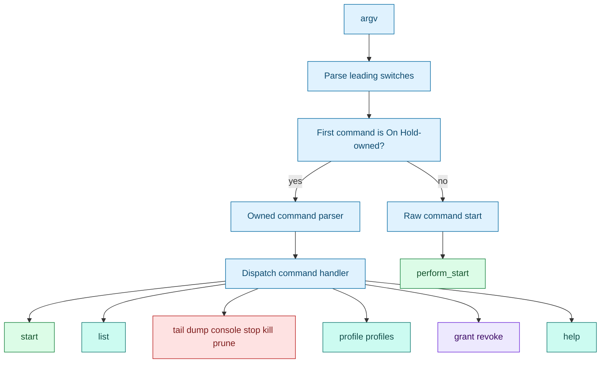

# CLI contract

> Status: This page is retained as parser/scripting reference context. The current 0.4 command language is tracked in [Hold 0.4 UX and CLI specification](HOLD_0_4_UX_SPEC.md), [0.4 object format repair](0.4-object-format-repair.md), and [0.4 release cut](0.4-release-cut.md).
[Docs index](index.md) | [Quickstart](quickstart.md) | [Previous: Console](console.md) | [Next: Using On Hold in CI](ci.md) | Related: [Launcher](launcher.md), [Target resolution](target-resolution.md)

Outer loop bridge: deep dive for quickstart Step 2, Manage It Later; Step 3, Understand Automatic Choices; and Step 7, Use It In CI.

This page is for people writing scripts around On Hold. It explains what goes to stdout, what goes to stderr, which flags belong to On Hold, which flags belong to the child command, and how exit codes should be treated.

The most important rule for scripts is that stdout carries machine data and stderr carries human status or diagnostics.

## Parser shape



Leading invocation switches include `--system`, `--elevated`, `--tail`/`-f`, `--console`, `--quiet`, and `--`. Once raw command parsing begins, remaining arguments belong to the child. In owned-command mode, On Hold continues parsing command-specific switches until a literal `--` marks the rest as owned command arguments.

Known owned commands are `list`, `run`, `start`, `stop`, `kill`, `tail`, `logs`, `status`, `inspect`, `dump`, `view`, `console`, `prune`, `profiles`, `profile`, `show`, `clean`, `doctor`, `shell`, `grant`, `revoke`, and `help`.

## Starts

Raw starts:

```bash
hold <command> [args...]
hold --system <command> [args...]
hold --console <command> [args...]
hold -f <command> [args...]
hold -- <command-that-looks-like-hold-action> [args...]
```

Owned starts:

```bash
hold start <profile>
hold start <profile> --multi
hold start <profile> --multi 3
hold start <profile> --multi=3
hold start <profile> --console
hold start <cmd> [args...]
hold run -- <cmd> [args...]
```

A successful start prints only the run ID to stdout before any followed log bytes. The human banner with the command, log path, tail command, optional console command, and stop command goes to stderr and is suppressed by `--quiet`.

## Listing

`hold list [profile]` shows visible runs. Normal users see their private user-local runs plus redacted root public rows. Root sees authoritative private system records. `--iso` and `-l` select ISO time formatting.

Normal list does not self-elevate. Root-public rows are discovery data and can show `unknown` state because the public index is not continuously refreshed.

## Action commands

Action commands are:

```text
tail
dump
console
stop
kill
prune
```

They resolve targets through `resolve_action_token`. `stop` sends `SIGTERM`, waits, and escalates to `SIGKILL` if needed. `kill` sends `SIGKILL`. `tail` follows a log and continues while the run is evaluated as running. `dump` prints the current log and exits. `console` attaches to a console-enabled run. `prune` removes past run data and related artifacts.

`stop --print <id>` and `kill --print <id>` print the equivalent `kill` command after validation. `--all` is accepted only for `stop`, `kill`, and `prune`, where it resolves profile ambiguity.

## Exit codes

The help text defines this contract:

| Code | Meaning |
| --- | --- |
| 0 | Success, including a known profile with nothing to do. |
| 1 | Usage or generic error. |
| 2 | Refused for safety. |
| 3 | Permission denied or storage/security failure. |
| 4 | Signal delivery failed. |
| 5 | Target not found or invalid target. |
| 6 | Must disambiguate. |

Some lower-level failures exit through `die_errno`, which prints a diagnostic and exits with code 1. Sudo self-elevation returns the child/root On Hold exit status when sudo successfully starts it, or sudo's own failure status when sudo denies, cancels, or cannot authenticate.

## Profiles and access commands

`hold profile save <id> as <name> [-v]` pins a recorded command as a profile. `hold profiles [-v]` lists visible profiles; user profiles show commands, while system profiles show `<root-managed>` and a profile hash display.

`hold grant <profile> <user> [actions]` and `hold revoke <profile> <user> [actions]` require root authority. Valid actions are `start`, `stop`, `kill`, `tail`, `dump`, `prune`, and `console`. If actions are omitted, all supported actions are selected.

## Why this design works

The parser protects the raw-command use case while still giving On Hold a structured management interface. That is important for the single-binary constraint: scripts can start arbitrary commands without config files, and management commands can still canonicalize targets for sudo and validation.

The stdout/stderr split exists because detached starts are commonly used in CI. A script can capture `run_id="$(hold ...)"` without scraping banners, while humans still get useful context on stderr.

## Implementation map

For maintainers, the primary functions are `main`, `hold_usage`, `hold_show_help`, `help_profiles`, `help_targets`, `help_access`, `help_system`, `help_scripting`, `help_console`, `help_action`, `hold_cli_command_is_parser_owned`, `hold_cli_command_is_public`, `hold_validate_owned_command_arity`, `hold_cmd_start_action`, `hold_cmd_list_normal`, `hold_cmd_list_system`, `hold_cmd_signal_action`, `hold_cmd_tail_action`, `hold_cmd_dump_action`, `hold_cmd_console_action`, `hold_cmd_prune_action`, `hold_cmd_profile_action`, and `hold_cmd_grant_revoke_action`.

## Continue

[Resume after Step 2: Step 3](quickstart.md#step-3-understand-automatic-choices) | [Resume after Step 3: Step 4](quickstart.md#step-4-make-targeting-deterministic) | [Finish after Step 7](index.md) | [Back to docs index](index.md) | [Top](#cli-contract) | [Next: Using On Hold in CI](ci.md) | Branch to: [Launcher](launcher.md), [Target resolution](target-resolution.md), [Security](security.md)
