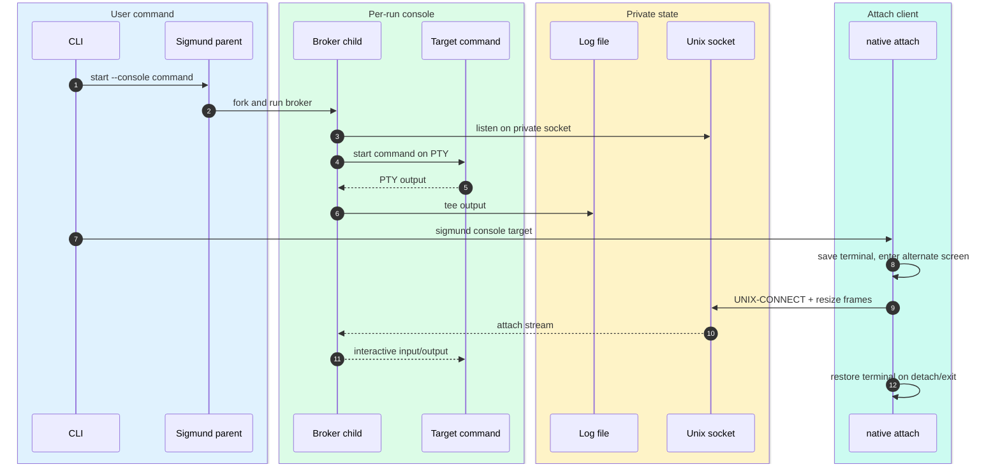
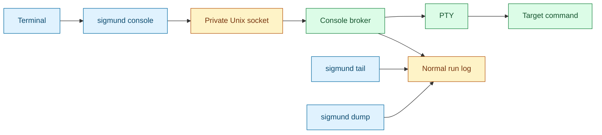

# Console

[Docs index](index.md) | [Quickstart](quickstart.md) | [Previous: Security](security.md) | [Next: CLI contract](cli-contract.md) | Related: [Launcher](launcher.md), [Target resolution](target-resolution.md)

Outer loop bridge: optional deep dive for quickstart Step 2, Manage It Later.

Console mode is for commands that need an interactive terminal after launch. `sigmund --console <cmd...>` starts the run behind a PTY broker, and a later `sigmund console <target>` attaches through a private Unix socket.

It is optional and does not replace normal logging. The same run still has a log for `tail` and `dump`.

## Start and attach

For console starts, the child path redirects stdio to `/dev/null` and calls `run_console_broker`. The broker owns the PTY and socket lifecycle.

The run record stores `console_sock` only when console mode is active. That path is private state. The system public index never includes it.

## Components

`run_native_console` checks that the socket path exists and is a socket, connects directly, and speaks Sigmund's console attach protocol. For an interactive TTY it saves the current terminal settings, switches to raw mode, enters the alternate screen, forwards window-size changes to the PTY, and restores the original terminal state on detach or exit. Ctrl-] detaches without stopping the run. Non-TTY attaches stream stdin/stdout without screen switching.

## Detach Without Stopping

Press `Ctrl-]` while attached with `sigmund console <target>` to release the console and return to your local shell. This closes only the attach client; the broker, PTY, and target process keep running so you can reattach later with the same `sigmund console <target>` command.

Do not use `Ctrl-C` when you mean detach. `Ctrl-C` is delivered to the attached process and may interrupt or stop it. Typing `exit` exits the shell or program inside the console.

`attach_console_record` handles user-facing outcomes:

- If the run is not running, it reports that the run has exited and points to `sigmund dump <id>`.
- If the run has no `console_sock`, it reports that the run has no console.
- Otherwise it attaches with the native console client.

## Resolution and authority

`console` is an action command and uses the same resolver as `tail`, `dump`, `stop`, `kill`, and `prune`. A run ID targets one run. An alias resolves only to running alias-labeled records with a console socket. More than one alias candidate exits 6 unless the command supports `--all`; `console` does not support `--all`.

Root-managed console attaches require root authority or self-elevation through the same system target and alias capability paths as other privileged actions. This is necessary because the console socket is private root state and because interactive process access is at least as sensitive as log or signal access.

## Logging behavior

Console output is still tee'd to the normal log. That means `sigmund tail <target>` and `sigmund dump <target>` keep their usual semantics for console-enabled runs. Console attach is an additional interactive path, not a special logging mode.

## Why this design works

Sigmund remains daemonless by making the broker a per-run child, not a global service. The socket path in the private record is enough for later attachment, and the same target resolver plus validator protects root-managed and user-local console access. The normal log remains the durable, scriptable output channel; the console is only the interactive channel.

## Implementation map

For maintainers, the primary functions are `make_console_listener`, `open_console_pty`, `broker_cleanup_and_exit`, `broker_fail_errno`, `run_console_broker`, `run_native_console`, `attach_console_record`, `cmd_console_action`, and `record_matches_alias_intent`.

## Continue

[Resume quickstart after Step 2: Step 3](quickstart.md#step-3-understand-automatic-choices) | [Back to docs index](index.md) | [Top](#console) | [Next: CLI contract](cli-contract.md) | Branch to: [Launcher](launcher.md), [Target resolution](target-resolution.md), [Security](security.md)
