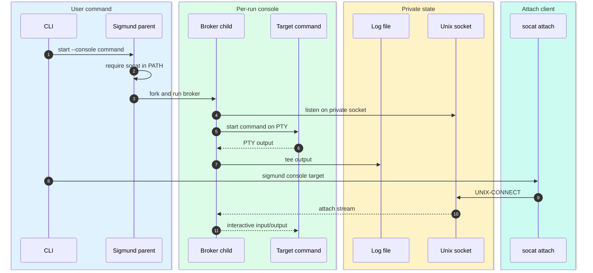
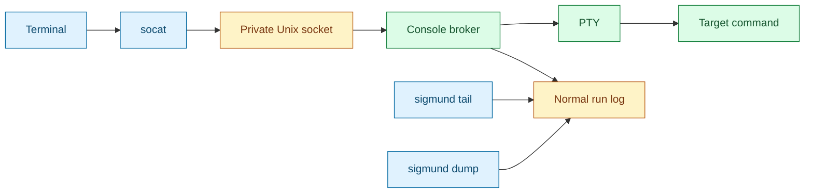

# Console

[Docs index](index.md) | [Previous: Security](security.md) | [Next: CLI contract](cli-contract.md) | Related: [Launcher](launcher.md), [Target resolution](target-resolution.md)

Console mode starts a run behind a PTY broker and lets a later `sigmund console <target>` attach through a private Unix socket. It is optional, requires `socat`, and does not replace normal logging.

The main functions are `make_console_listener`, `open_console_pty`, `run_console_broker`, `run_socat_console`, `attach_console_record`, and `cmd_console_action`.

## Start and attach

`perform_start` refuses `--console` before generating a run ID if `socat` is not available in `PATH`. For console starts, the child path redirects stdio to `/dev/null` and calls `run_console_broker`. The broker owns the PTY and socket lifecycle.

The run record stores `console_sock` only when console mode is active. That path is private state. The system public index never includes it.

## Components

`run_socat_console` checks that the socket path exists and is a socket, builds `UNIX-CONNECT:<console_sock>`, and execs `socat`. If stdin is a TTY, it uses raw terminal mode through the `-,raw,echo=0` socat endpoint. Otherwise it uses `-`.

`attach_console_record` handles user-facing outcomes:

- If the run is not running, it reports that the run has exited and points to `sigmund dump <id>`.
- If the run has no `console_sock`, it reports that the run has no console.
- Otherwise it attaches with `socat`.

## Resolution and authority

`console` is an action command and uses the same resolver as `tail`, `dump`, `stop`, `kill`, and `prune`. A run ID targets one run. An alias resolves only to running alias-labeled records with a console socket. More than one alias candidate exits 6 unless the command supports `--all`; `console` does not support `--all`.

Root-managed console attaches require root authority or self-elevation through the same system target and alias capability paths as other privileged actions. This is necessary because the console socket is private root state and because interactive process access is at least as sensitive as log or signal access.

## Logging behavior

Console output is still tee'd to the normal log. That means `sigmund tail <target>` and `sigmund dump <target>` keep their usual semantics for console-enabled runs. Console attach is an additional interactive path, not a special logging mode.

## Why this design works

Sigmund remains daemonless by making the broker a per-run child, not a global service. The socket path in the private record is enough for later attachment, and the same target resolver plus validator protects root-managed and user-local console access. The normal log remains the durable, scriptable output channel; the console is only the interactive channel.

## Source anchors

Primary functions: `executable_available`, `make_console_listener`, `open_console_pty`, `broker_cleanup_and_exit`, `broker_fail_errno`, `run_console_broker`, `run_socat_console`, `attach_console_record`, `cmd_console_action`, and `record_matches_alias_intent`.

## Continue

[Back to docs index](index.md) | [Top](#console) | [Next: CLI contract](cli-contract.md) | Branch to: [Launcher](launcher.md), [Target resolution](target-resolution.md), [Security](security.md)
