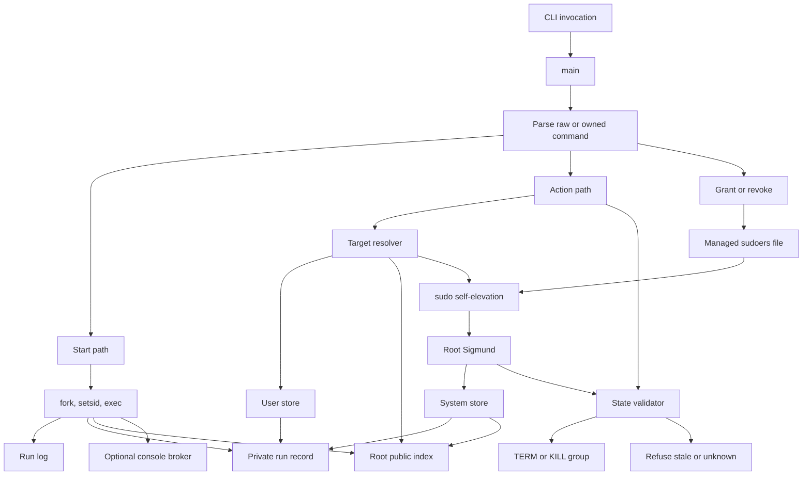

# Sigmund design documentation

Sigmund is a daemonless process launcher and recorder implemented in `src/sigmund.c`. It starts a command in a new session, writes a durable run record and log path, and later uses that record to inspect, tail, stop, kill, or prune the tracked process group. The design is intentionally "more than nohup, less than systemd": there is no resident supervisor, but Sigmund records enough identity to validate a target before it sends a signal.

The two constraints that shape the code are:

- Validate before signal: an action must prove that the recorded PID/process group still matches the intended run, or refuse the action.
- Daemonless single binary: all state must be recoverable from files and the current process table because no daemon is refreshing state in the background.

## Architecture

`main` is the dispatch center. It distinguishes raw command starts from Sigmund-owned commands, builds the invocation context, initializes the relevant store, and routes to start, list, action, alias, or grant/revoke handlers. Starts flow through `perform_start`. Actions flow through target resolution and then, for signal-bearing commands, through `do_signal_action`. Root-managed public records are deliberately redacted discovery hints; private records remain authoritative.

## Subsystems

| Page | Purpose |
| --- | --- |
| [Launcher](launcher.md) | How Sigmund starts child processes, records them, tails logs, and handles launch failure. |
| [Store](store.md) | User-local and system-managed state, record formats, public redaction, atomic writes, and pruning. |
| [Identity](identity.md) | Boot ID, starttime, executable identity, session membership, run states, and validate-before-signal safety. |
| [Target resolution](target-resolution.md) | Run ID, prefix, alias, `user:`, `system:`, root-public, and sudo-aware addressing rules. |
| [Profiles and aliases](profiles-and-aliases.md) | Reusable launch recipes, SHA-256 profile fingerprints, alias starts, and `--multi`. |
| [Security](security.md) | `--system`, sudo self-elevation, capability argv, sudoers grants, and privilege-boundary checks. |
| [Console](console.md) | PTY-backed console starts, private Unix sockets, `socat` attach, and console/log interaction. |
| [CLI contract](cli-contract.md) | Parser behavior, stdout/stderr contract, flags, exit codes, list/tail/dump/stop/kill/prune behavior. |
| [CI example](ci.md) | A GitHub Actions workflow that uses the implemented scriptable contract. |
| [Specification](SPEC.md) | Existing implementation contract reference. |

## Contributor mental model

A run record is a handle, not a promise that the process still exists. The record captures the run ID, PID, PGID, SID, launch time, command display, log path, optional alias, optional console socket, boot marker, and best-effort process identity. Later actions resolve a user token to one concrete store and run ID, load the private record when authority allows it, evaluate current process state, and only then act.

This design trades continuous supervision for durable validation. Sigmund cannot know every state transition as it happens, but it can refuse dangerous operations when the current process table no longer matches the saved identity. That is why many pages in this documentation converge on the same rule: data on disk selects the intended run, and live validation decides whether it is safe to interact with it.

## Source anchors

The main source anchors for this overview are `main`, `perform_start`, `write_record_atomic`, `write_public_index_atomic`, `resolve_action_token`, `eval_state`, `do_signal_action`, `elevate_with_sudo_canonical`, and `cmd_elevated_capability_action` in `src/sigmund.c`.
