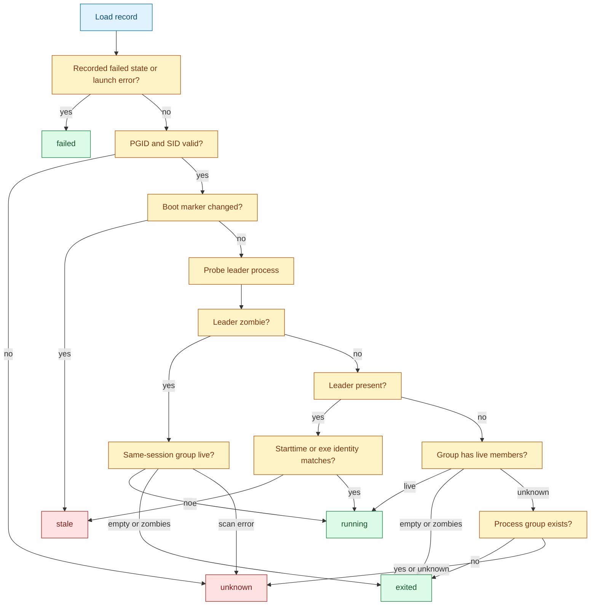
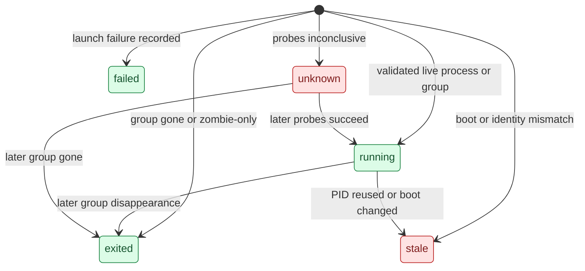

# Identity and validation

[Docs index](index.md) | [Quickstart](quickstart.md) | [Previous: Store](store.md) | [Next: Target resolution](target-resolution.md) | Related: [Launcher](launcher.md), [Security](security.md)

Outer loop bridge: deep dive for quickstart Step 2, Manage It Later.

Sigmund records process identity at launch and rechecks it before dangerous actions. This is why `sigmund stop <id>` is safer than `kill $PID`: a run ID selects a record, but the record must still match the current process table before Sigmund sends a signal.

If the evidence is stale or inconclusive, Sigmund refuses. That refusal is intentional user protection, not a cleanup failure to hide.

## Recorded identity

A run record stores:

- `pid`: the launched leader process.
- `pgid`: the process group to signal.
- `sid`: the session created by `setsid`.
- `boot_id`: a boot marker when available.
- `proc_starttime_ticks`: process starttime from platform process metadata when available.
- `exe_dev` and `exe_ino`: executable device/inode identity when available.

These fields are intentionally redundant. Linux generally provides `/proc/<pid>/stat`, `/proc/<pid>/exe`, and `/proc/sys/kernel/random/boot_id`. macOS uses best-effort process metadata and `kern.boottime`. The code treats some probes as optional because Sigmund must remain a small single binary across both platforms.

## State evaluation

`eval_state` first honors an explicit failed launch state. It then rejects invalid PGID/SID values as unknown. If the record has a boot ID and the current boot marker differs, the run is stale. After that, Sigmund checks the leader process and same-session group members.

A zombie leader is not automatically treated as done. If live same-session group members remain, the run is still running for teardown purposes. If the group is empty or zombie-only, the run is exited.

## Run states

Only `running`, `exited`, and `failed` are benign for action decisions. `stale` and `unknown` are safety stops for signaling. If Sigmund cannot validate the record, it refuses instead of risking a signal to a reused PID or unrelated process group.

## Signal safety

`do_signal_action` loads the private record, checks the stored boot ID against the current boot marker when both are available, calls `eval_state`, and refuses `stale` or `unknown`. If the run has already exited or failed, it reports success with `already_done`. If the run is still running, it signals the whole process group.

For `stop`, Sigmund sends `SIGTERM`, waits up to `STOP_TIMEOUT_MS`, then sends `SIGKILL` if the group is still present. For `kill`, it sends `SIGKILL` immediately. After signaling, `report_session_escapees` can warn when live processes remain in the same session but outside the expected process group.

`do_print_signal_command` follows the same validation rule before printing the equivalent `kill -TERM -- -<pgid>` or `kill -KILL -- -<pgid>` command. Even dry-run output is not produced for stale or unknown records.

## Why this design works

PID reuse is the core hazard. A daemon could keep richer live state, but Sigmund intentionally has no daemon. Its answer is to record enough identity at launch and combine that with live probes before every signal. If the current machine state is ambiguous, the safe result is refusal.

The session scan exists because the process group leader can exit while useful descendants remain. That is common in launcher and shell-wrapper workloads. Treating same-session live group members as running lets Sigmund clean up the workload it started without pretending the leader PID alone is authoritative.

## Implementation map

For maintainers, the primary functions are `get_boot_id`, `current_boot_id`, `read_process_ids_state`, `group_session_liveness`, `count_session_escapees`, `report_session_escapees`, `read_proc_stat_tokens`, `read_proc_exe`, `leader_present`, `group_exists`, `eval_state`, `do_signal_action`, and `do_print_signal_command`.

## Continue

[Resume quickstart after Step 2: Step 3](quickstart.md#step-3-understand-automatic-choices) | [Back to docs index](index.md) | [Top](#identity-and-validation) | [Next: Target resolution](target-resolution.md) | Branch to: [Launcher](launcher.md), [Security](security.md)
