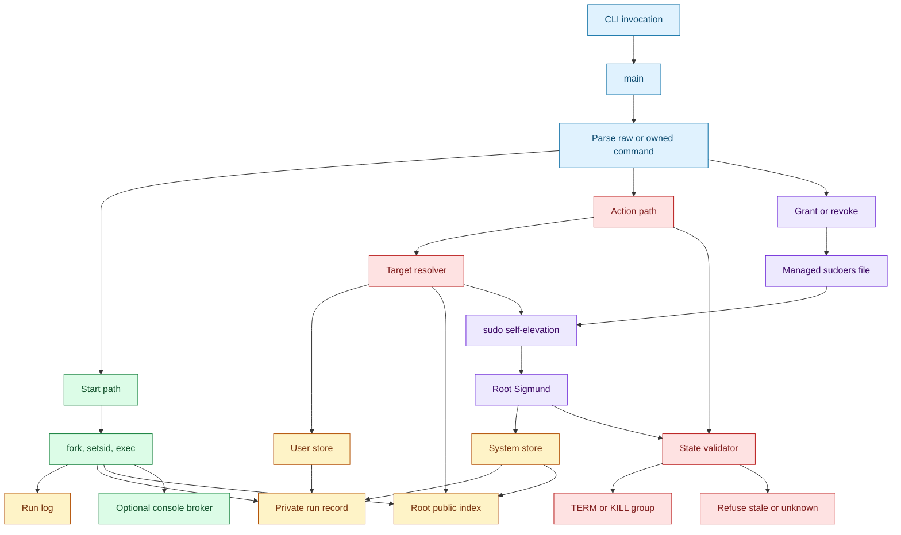
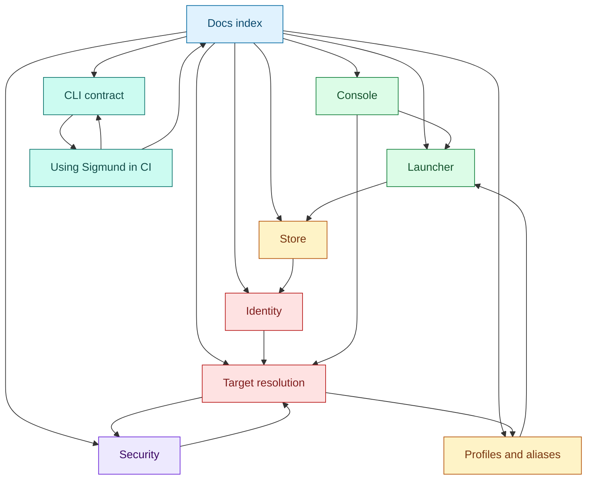

# Sigmund documentation index

[Repository README](../README.md) | [Specification](SPEC.md)

This is the top-level developer documentation for `src/sigmund.c`. Start here, branch into the subsystem that matches the code you are changing, then use each page's related links to move sideways through the logic. Every subsystem page links back here and forward to the next major concept, so the documentation forms a loop instead of a dead end.

Sigmund is a daemonless process launcher and recorder. It starts a command in a new session, writes a durable run record and log path, and later uses that record to inspect, tail, stop, kill, or prune the tracked process group. The design is intentionally "more than nohup, less than systemd": there is no resident supervisor, but Sigmund records enough identity to validate a target before it sends a signal.

The two constraints that shape the code are:

- Validate before signal: an action must prove that the recorded PID/process group still matches the intended run, or refuse the action.
- Daemonless single binary: all state must be recoverable from files and the current process table because no daemon is refreshing state in the background.

## Architecture

`main` is the dispatch center. It distinguishes raw command starts from Sigmund-owned commands, builds the invocation context, initializes the relevant store, and routes to start, list, action, alias, or grant/revoke handlers. Starts flow through `perform_start`. Actions flow through target resolution and then, for signal-bearing commands, through `do_signal_action`. Root-managed public records are deliberately redacted discovery hints; private records remain authoritative.

## Reading Paths

## Main Loop

1. [Launcher](launcher.md): starts, fork/setsid/exec, logs, records, and launch rollback.
2. [Store](store.md): user-local and system-managed state, record shape, public redaction, atomic writes, and pruning.
3. [Identity and validation](identity.md): boot ID, starttime, executable identity, session membership, run states, and signal refusal.
4. [Target resolution](target-resolution.md): ID, prefix, alias, `user:`, `system:`, ambiguity, and action target expansion.
5. [Profiles and aliases](profiles-and-aliases.md): reusable launch recipes, SHA-256 fingerprints, alias starts, and `--multi`.
6. [Security and privilege boundaries](security.md): `--system`, sudo self-elevation, capability argv, and managed sudoers.
7. [Console](console.md): PTY console starts, private sockets, `socat` attach, and log teeing.
8. [CLI contract](cli-contract.md): parser behavior, stdout/stderr, flags, no-op behavior, and exit codes.
9. [Using Sigmund in CI](ci.md): copyable CI patterns for start, readiness, logs, teardown, exit codes, and multiple helpers.

## Branch by Task

| If you are changing... | Start with | Then read |
| --- | --- | --- |
| Process launch, logs, or tailing | [Launcher](launcher.md) | [Store](store.md), [Identity](identity.md), [CLI contract](cli-contract.md) |
| JSON records, public index, pruning | [Store](store.md) | [Identity](identity.md), [Target resolution](target-resolution.md) |
| Signal safety or process-state checks | [Identity](identity.md) | [Launcher](launcher.md), [Target resolution](target-resolution.md) |
| IDs, aliases, `user:`/`system:` lookup | [Target resolution](target-resolution.md) | [Profiles and aliases](profiles-and-aliases.md), [Security](security.md) |
| Alias start behavior or profile hashes | [Profiles and aliases](profiles-and-aliases.md) | [Store](store.md), [Security](security.md) |
| Sudo, grants, or root-managed actions | [Security](security.md) | [Target resolution](target-resolution.md), [Profiles and aliases](profiles-and-aliases.md) |
| Interactive console support | [Console](console.md) | [Launcher](launcher.md), [Target resolution](target-resolution.md), [Security](security.md) |
| Scripting or CI behavior | [CLI contract](cli-contract.md) | [Using Sigmund in CI](ci.md), [Launcher](launcher.md) |

## Reference

- [Current implementation specification](SPEC.md)
- [Documentation plan and review notes](PLAN.md)
- [Repository README](../README.md)

## Source Anchors

The main source anchors for this overview are `main`, `perform_start`, `write_record_atomic`, `write_public_index_atomic`, `resolve_action_token`, `eval_state`, `do_signal_action`, `elevate_with_sudo_canonical`, and `cmd_elevated_capability_action` in `src/sigmund.c`.
