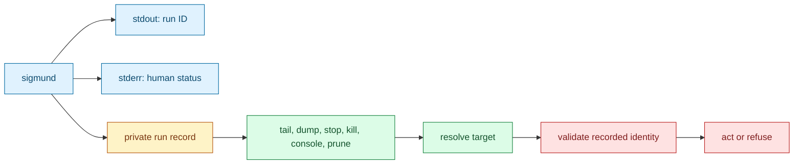
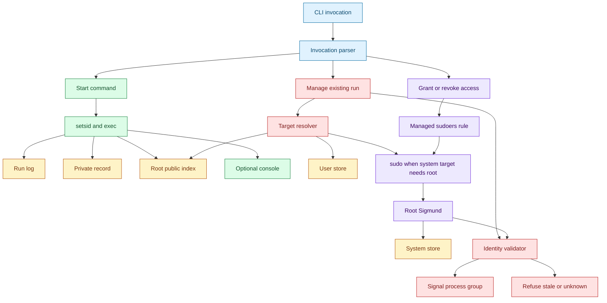
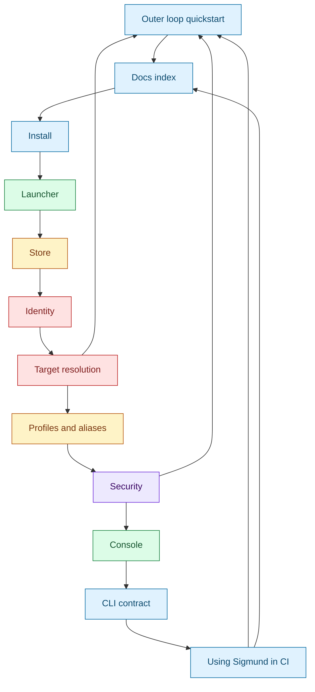

# Sigmund documentation index

[Repository README](../README.md) | [Outer onboarding loop](quickstart.md) | [Technical reference loop](#technical-reference-loop) | [Specification](SPEC.md)

This is the top-level guide to how Sigmund works. Start with the [quickstart](quickstart.md): it walks from the first command to deterministic targeting, aliases, and scoped root delegation with simple diagrams, and links into the deeper subsystem pages as each concept appears.

Sigmund is a daemonless process launcher and recorder. It starts a command in a new session, writes a durable run record and log path, and later uses that record to inspect, tail, stop, kill, attach, or prune the tracked process group.

The philosophy is simple:

- Make the easy path easy: `sigmund <cmd...>` gives users a run ID, log, and safe cleanup path.
- Make automatic choices predictable: invocation shape decides user-local versus system-managed behavior.
- Make precision available: `user:<target>`, `system:<target>`, aliases, and grants let users say exactly what they mean.
- Validate before signal: if Sigmund cannot prove a recorded process group is still the intended run, it refuses instead of guessing.

## Navigation Model

The documentation has two layers:

- Outer loop: [Quickstart](quickstart.md), a clean onboarding walkthrough that can be read start to finish.
- Inner layer: [Technical reference loop](#technical-reference-loop), deep-dive pages for internals, edge cases, data flow, and implementation details.
- Bridge links: each quickstart step can detour into a matching deep dive, and each deep dive resumes at the next walkthrough step so the reader does not lose forward motion.

## Start Here

| If you want to... | Start with | Then go deeper |
| --- | --- | --- |
| Install Sigmund | [Installing Sigmund](install.md) | [Using Sigmund in CI](ci.md) |
| Learn the normal workflow | [Quickstart](quickstart.md) | [Launcher](launcher.md), [Store](store.md) |
| Use Sigmund in CI | [Using Sigmund in CI](ci.md) | [CLI contract](cli-contract.md), [Identity](identity.md) |
| Understand target choices and collisions | [Quickstart targeting](quickstart.md#step-4-make-targeting-deterministic) | [Target resolution](target-resolution.md) |
| Create reusable names | [Quickstart aliases](quickstart.md#step-5-create-an-alias) | [Profiles and aliases](profiles-and-aliases.md) |
| Delegate one root-managed tool safely | [Quickstart delegation](quickstart.md#step-6-delegate-one-root-managed-tool) | [Security](security.md) |

## Core Flow

That is the promise Sigmund makes to users: a simple launch command turns into a durable handle, and later management commands use that handle carefully instead of relying on a hand-copied PID.

## Architecture

## Technical Reference Loop

Every subsystem page links back here, names the quickstart step it explains, resumes at the next walkthrough step, and points forward to the next technical concept, so readers can browse the inner layer as a reference system without losing the outer-loop return path.

## Inner Layer Pages

1. [Quickstart](quickstart.md): user workflow, automatic choices, deterministic targeting, aliases, and scoped root delegation.
2. [Installing Sigmund](install.md): one-line install, root/user install mode, platform detection, checksums, and script handoff.
3. [Launcher](launcher.md): starts, fork/setsid/exec, logs, records, and launch rollback.
4. [Store](store.md): user-local and system-managed state, public redaction, atomic writes, and pruning.
5. [Identity and validation](identity.md): boot ID, starttime, executable identity, session membership, run states, and signal refusal.
6. [Target resolution](target-resolution.md): ID, prefix, alias, `user:`, `system:`, ambiguity, and action target expansion.
7. [Profiles and aliases](profiles-and-aliases.md): reusable launch recipes, SHA-256 fingerprints, alias starts, and `--multi`.
8. [Security and privilege boundaries](security.md): `--system`, sudo self-elevation, capability argv, and managed sudoers.
9. [Console](console.md): PTY console starts, private sockets, `socat` attach, and log teeing.
10. [CLI contract](cli-contract.md): parser behavior, stdout/stderr, flags, no-op behavior, and exit codes.
11. [Using Sigmund in CI](ci.md): copyable CI patterns for start, readiness, logs, teardown, exit codes, and multiple helpers.

## Branch by Question

| If you want to understand... | Read |
| --- | --- |
| How to install Sigmund and hand its path to scripts | [Installing Sigmund](install.md) |
| How a command keeps running after the CI step or shell exits | [Quickstart](quickstart.md), then [Launcher](launcher.md) |
| Where run IDs, logs, aliases, and public root hints live | [Store](store.md) |
| Why `stop` is safer than `kill $PID` | [Identity and validation](identity.md) |
| How IDs, aliases, `user:`, and `system:` choose a target | [Target resolution](target-resolution.md) |
| How to reuse a recorded command as an alias | [Profiles and aliases](profiles-and-aliases.md) |
| How to let another user manage one root-run tool | [Quickstart](quickstart.md#step-6-delegate-one-root-managed-tool), then [Security](security.md) |
| How to script Sigmund in CI | [Using Sigmund in CI](ci.md), then [CLI contract](cli-contract.md) |

## Reference

- [Current implementation specification](SPEC.md)
- [Documentation plan and review notes](PLAN.md)
- [Repository README](../README.md)

## Implementation map

For maintainers, the main source anchors for this overview are `main`, `perform_start`, `write_record_atomic`, `write_public_index_atomic`, `resolve_action_token`, `eval_state`, `do_signal_action`, `elevate_with_sudo_canonical`, and `cmd_elevated_capability_action` in `src/sigmund.c`.
