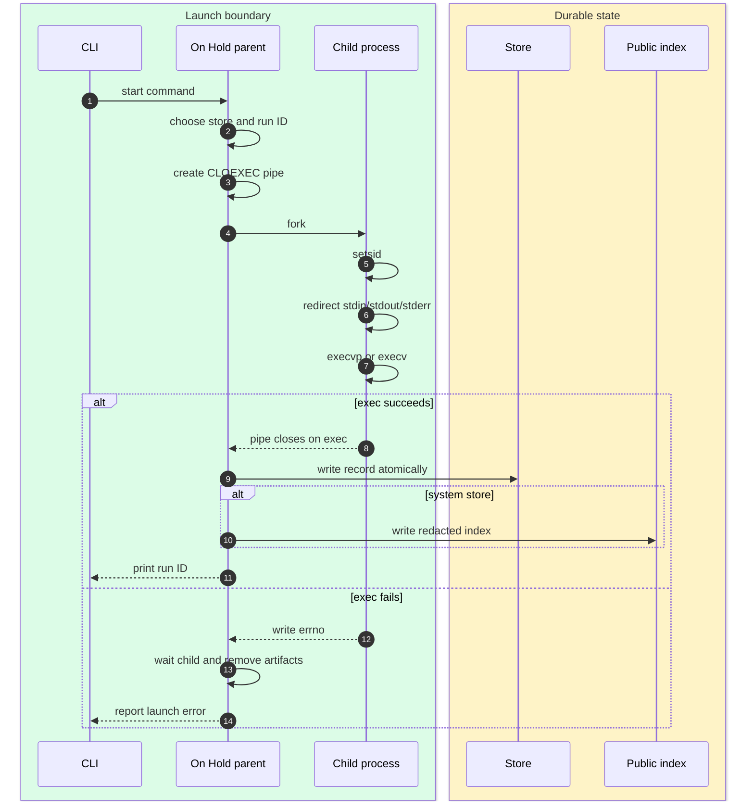
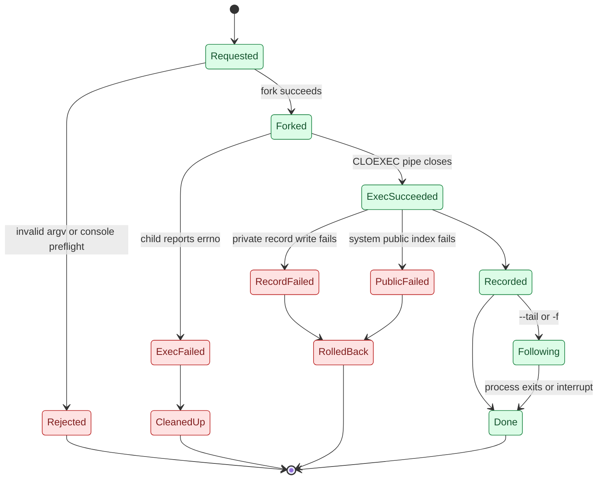

# Launcher

[Docs index](index.md) | [Quickstart](quickstart.md) | [Previous: Index](index.md) | [Next: Store](store.md) | Related: [Identity](identity.md), [Console](console.md), [CLI contract](cli-contract.md)

Outer loop bridge: deep dive for quickstart Step 1, Start One Thing.

When you run `hold <cmd...>`, the launcher turns that command into a detached run with a short ID and a log. This is the piece that lets a helper survive after the CI step or shell that started it exits.

The end result of a successful start is a bare 8-hex run ID on stdout, a private JSON record, a log file, and optionally a console socket. Human status goes through `sig_note`, which writes to stderr unless `--quiet` is set.

## Start forms

On Hold supports two start styles:

- Raw form: `hold <cmd> [args...]`.
- Owned form: `hold start <profile>` or `hold start <cmd> [args...]`.

If `start` receives exactly one argument and that token resolves to a profile, `cmd_start_action` starts the stored recipe. Otherwise it starts the provided command. `perform_explicit_start` treats a single explicit command string as `sh -c <string>` and treats multiple arguments as direct argv for `execvp`.

This split exists because On Hold is a single binary, not a service manager with a configuration language. It must preserve raw argv for scriptability, but it also needs a compact owned command surface for profiles, multi-starts, and privilege crossing.

## Launch sequence

The parent creates a close-on-exec pipe before forking. The child writes `errno` to the pipe if `setsid`, redirection, console broker setup, or `exec*` fails. If `exec*` succeeds, the pipe closes because of `FD_CLOEXEC`, and `read_exec_handshake` reports success. This avoids recording a run that never actually launched.

The child calls `setsid`, so the child PID, process group ID, and session ID are initially the same. On Hold records that identity and later signals the process group with `kill(-pgid, sig)` after validation. This is the minimum machinery needed to outlive the invoking shell while keeping teardown tied to a recorded group rather than a hand-copied PID.

## Launch states

A private record write failure kills the spawned group, removes the reservation and log, and exits through `die_errno`. A root-managed public-index write failure also rolls back the private record and child process. That all-or-nothing behavior matters because a root-managed run that normal users cannot discover would break the public redacted discovery model.

## Logging and tailing

For non-console runs, stdin is `/dev/null` and stdout/stderr append to `<id>.log` with mode `0600`. For console runs, the broker tees PTY output to the same log, so `tail` and `dump` work the same way for console and non-console starts.

`tail_log_until_exit` opens the recorded log path with `O_NOFOLLOW`, optionally seeks to the end, streams data to stdout, and periodically re-evaluates process state. During a start with `--tail` or `-f`, the run is already recorded before tailing begins. That preserves the scriptable contract: stdout first receives the run ID, then followed log bytes.

## Why this design works

The fork/setsid/exec path gives On Hold the part `nohup` and `setsid` users usually want: a child that outlives the shell's teardown. The record and handshake provide the part a bare background process does not: a durable ID whose process group can later be validated before signaling. Because there is no daemon, the launch path must record enough identity immediately, and it must roll back if it cannot make the record authoritative.

## Implementation map

For maintainers, the primary functions are `perform_start`, `perform_explicit_start`, `cmd_start_action`, `perform_profile_start`, `read_exec_handshake`, `rollback_spawned_group`, `tail_log_until_exit`, and `write_record_atomic`.

## Continue

[Resume quickstart after Step 1: Step 2](quickstart.md#step-2-manage-it-later) | [Back to docs index](index.md) | [Top](#launcher) | [Next: Store](store.md) | Branch to: [Console](console.md), [CLI contract](cli-contract.md), [Identity](identity.md)
