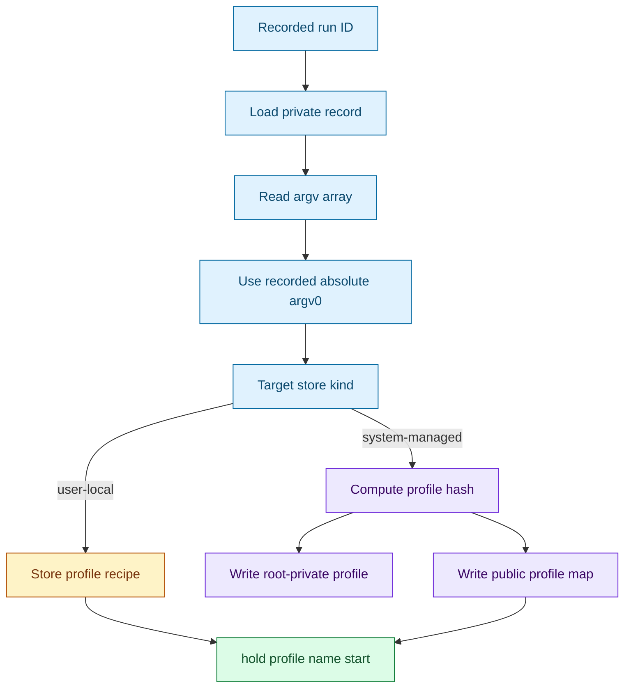
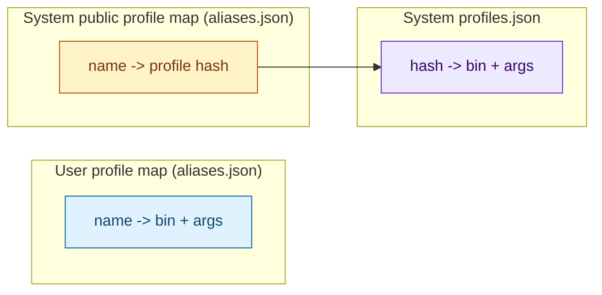

# Profiles and storage aliases

> Status: This page is retained as profile reference context. The current 0.4 profile/run/grant object-shape decisions are tracked in [Hold 0.4 UX and CLI specification](HOLD_0_4_UX_SPEC.md), [0.4 object format repair](0.4-object-format-repair.md), and [0.4 release cut](0.4-release-cut.md).
[Docs index](index.md) | [Quickstart](quickstart.md) | [Previous: Target resolution](target-resolution.md) | [Next: Security](security.md) | Related: [Store](store.md), [Launcher](launcher.md)

Outer loop bridge: deep dive for quickstart Step 5, Create a Profile.

Profiles are the renamed and extended form of the original reusable-name idea: a recorded command becomes a reusable launch target. Users get a friendly name such as `web`, while On Hold keeps the core command recipe — resolved binary plus argv — needed to start that same command again later.

There are two current storage modes during the rename/extension:

- User-local profiles store a private launch recipe directly in the user's profile-name mapping. On disk this still uses the existing `aliases.json` file until the storage filename/schema migration lands.
- System-managed profiles expose a public name-to-hash mapping while keeping the protected launch recipe in root-private `profiles.json`.

## From run to profile



The `hold profile save <id> as <name>` flow first resolves `<id>` to a concrete run. It then reads the record, extracts `argv`, uses the recorded absolute `argv[0]`, and writes either a user profile recipe or a root profile plus public name mapping. If the target is a root-public run from a normal user, On Hold self-elevates before creating the system-managed profile.

This is intentional: `perform_start` resolves the executable before writing the run record. A run started as `../bin/daemon` records the absolute executable path, so a profile created later from another directory does not reinterpret that relative path.

The profile name is also recorded on future runs started through that profile. Later action commands resolve the profile label stored on run records, not by recomputing the launch recipe.

## Profile fingerprint

System-managed profiles use a SHA-256 fingerprint as a stable capability key. `profile_hash_for_argv` hashes this NUL-delimited material:

```text
hold-profile
resolved absolute binary path
argc
argv[0] index
argv[0]
argv[1] index
argv[1]
...
```

The hash input intentionally excludes environment, current directory, UID, GID, hostname, timestamps, and On Hold version. The source comment states that existing profile mappings, profiles, and sudoers grants are keyed to exactly this binary-path plus argv framing.

This is not a run ID. A run ID names one run record. A profile hash names a protected launch recipe and appears in root-private profiles, public profile-name mappings, and sudo capability argv.

## Stored shapes



User-local profile recipes are private because they reveal the command. System public profile-name mappings reveal only a name and profile hash; the command itself remains in root-private `profiles.json`.

## Starting profiles

`cmd_start_action` treats `hold start <token>` as a profile start only when exactly one argument resolves through `resolve_start_profile_target`. For user-local recipes, On Hold starts the stored recipe directly. For system-managed profiles visible to a normal user, it builds a start capability and crosses sudo. Root On Hold verifies the profile-name/hash pair before loading the profile.

By default, starting a named profile refuses if that profile already has a running process. `--multi` bypasses that guard. Bare `--multi` starts one additional run; `--multi N` and `--multi=N` start `N` runs. `--tail` cannot follow multiple starts.

## Why this design works

Profiles give a daemonless tool a small amount of durable intent without becoming a service configuration system. The recorded run provides the initial exact argv, and later starts reuse that immutable recipe. For root-managed profiles, the hash lets sudoers grants and capability argv refer to a fixed command without exposing the command in public discovery files.

The validate-before-signal constraint still applies after profile creation. Profiles select candidate runs by recorded label, and signal actions validate those concrete run records before touching their process groups.

## Implementation map

For maintainers, the primary functions and structs are `struct profile`, `struct alias_entry`, `profile_hash_for_argv`, `resolve_binary_path`, `cmd_alias_action`, `write_profile_atomic`, `write_profiles_atomic`, `alias_upsert_recipe`, `alias_upsert_hash`, `resolve_start_profile_target`, `count_running_alias`, `perform_profile_start`, and `cmd_start_action`.

## Continue

[Resume quickstart after Step 5: Step 6](quickstart.md#step-6-delegate-one-root-managed-tool) | [Back to docs index](index.md) | [Top](#profiles-and-aliases) | [Next: Security](security.md) | Branch to: [Store](store.md), [Launcher](launcher.md), [Target resolution](target-resolution.md)
