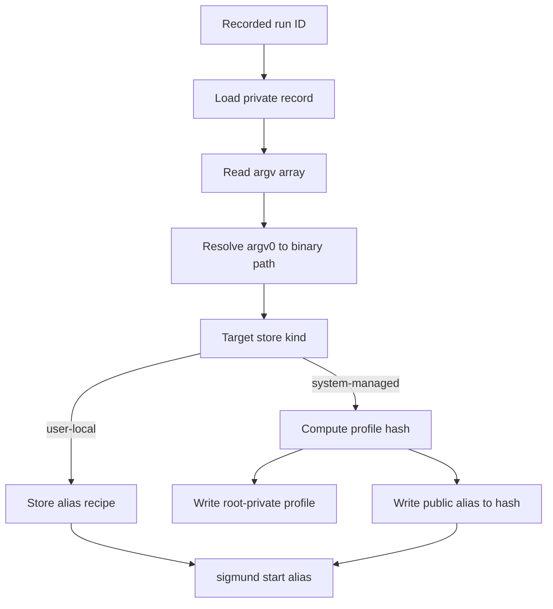
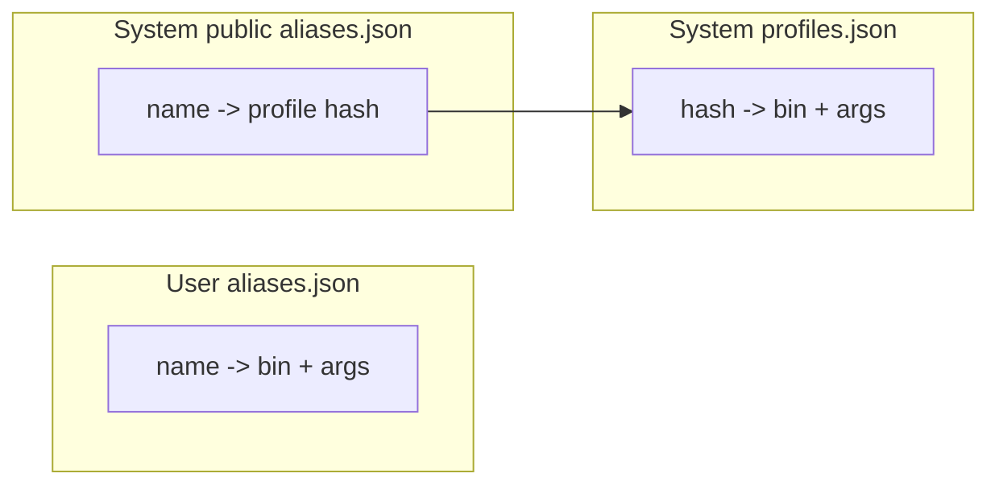

# Profiles and aliases

Aliases turn a recorded command into a reusable launch target. The implementation has two storage modes:

- User-local aliases store a private launch recipe directly in the user's `aliases.json`.
- System-managed aliases expose a public alias-to-hash mapping while keeping the protected launch recipe in root-private `profiles.json`.

The key functions are `cmd_alias_action`, `profile_hash_for_argv`, `write_profile_atomic`, `alias_upsert_recipe`, `alias_upsert_hash`, `resolve_start_profile_target`, and `cmd_start_action`.

## From run to alias



`sigmund alias <id> <name>` first resolves `<id>` to a concrete run. It then reads the record, extracts `argv`, resolves `argv[0]` to an absolute binary path, and writes either a user recipe or a root profile plus public alias. If the target is a root-public run from a normal user, Sigmund self-elevates before creating the system alias.

The alias name is also recorded on future runs started through that alias. Later action commands resolve the alias by the label stored on run records, not by recomputing the launch recipe.

## Profile fingerprint

System-managed aliases use a SHA-256 fingerprint as a stable capability key. `profile_hash_for_argv` hashes this NUL-delimited material:

```text
sigmund-profile
resolved absolute binary path
argc
argv[0] index
argv[0]
argv[1] index
argv[1]
...
```

The hash input intentionally excludes environment, current directory, UID, GID, hostname, timestamps, and Sigmund version. The source comment states that existing aliases, profiles, and sudoers grants are keyed to exactly this binary-path plus argv framing.

This is not a run ID. A run ID names one run record. A profile hash names a protected launch recipe and appears in root-private profiles, public aliases, and sudo capability argv.

## Stored shapes



User aliases are private because they reveal the command. System public aliases reveal only an alias and profile hash; the command itself remains in root-private `profiles.json`.

## Starting aliases

`cmd_start_action` treats `sigmund start <token>` as an alias/profile start only when exactly one argument resolves through `resolve_start_profile_target`. For user-local recipes, Sigmund starts the stored recipe directly. For system-managed aliases visible to a normal user, it builds a start capability and crosses sudo. Root Sigmund verifies the alias/hash pair before loading the profile.

By default, `start <alias>` refuses if that alias already has a running process. `--multi` bypasses that guard. Bare `--multi` starts one additional run; `--multi N` and `--multi=N` start `N` runs. `--tail` cannot follow multiple starts.

## Why this design works

Aliases give a daemonless tool a small amount of durable intent without becoming a service configuration system. The recorded run provides the initial exact argv, and later starts reuse that immutable recipe. For root-managed aliases, the hash lets sudoers grants and capability argv refer to a fixed command without exposing the command in public discovery files.

The validate-before-signal constraint still applies after aliasing. Aliases select candidate runs by recorded label, and signal actions validate those concrete run records before touching their process groups.

## Source anchors

Primary functions and structs: `struct profile`, `struct alias_entry`, `profile_hash_for_argv`, `resolve_binary_path`, `cmd_alias_action`, `write_profile_atomic`, `write_profiles_atomic`, `alias_upsert_recipe`, `alias_upsert_hash`, `resolve_start_profile_target`, `count_running_alias`, `perform_profile_start`, and `cmd_start_action`.
