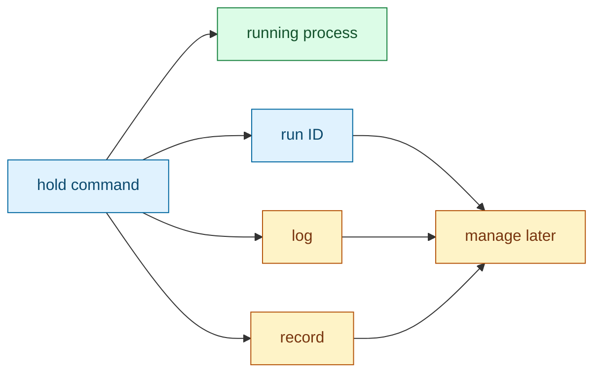
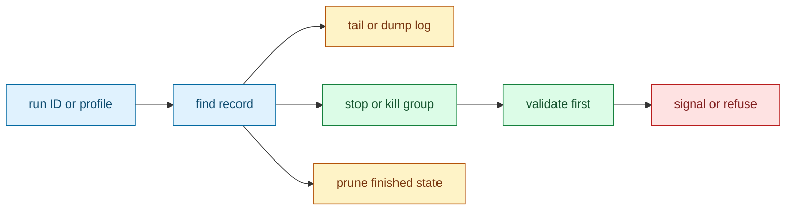
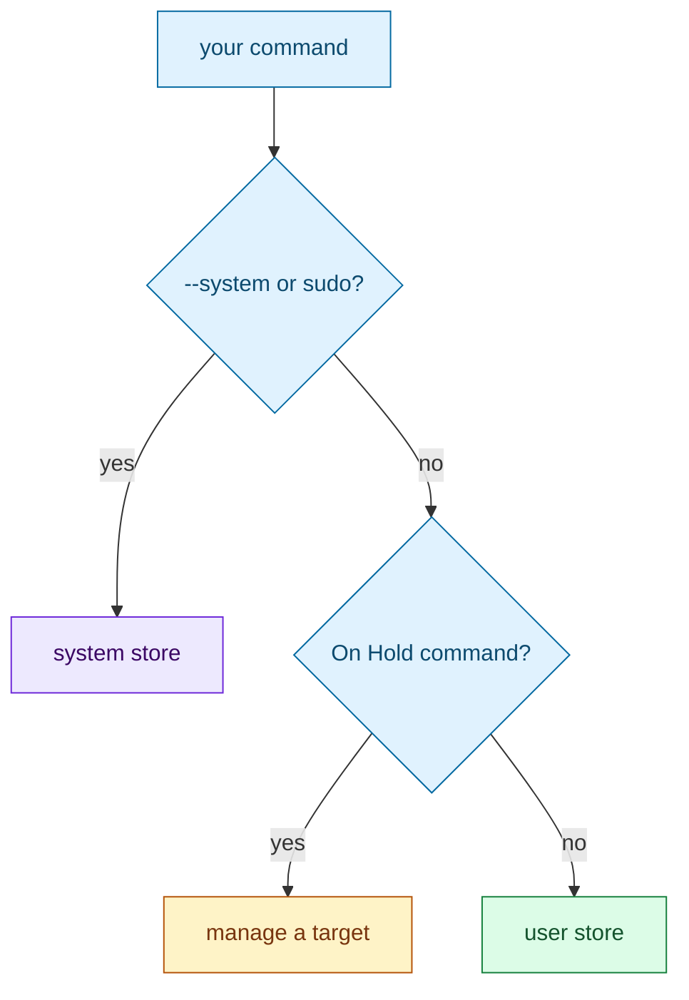
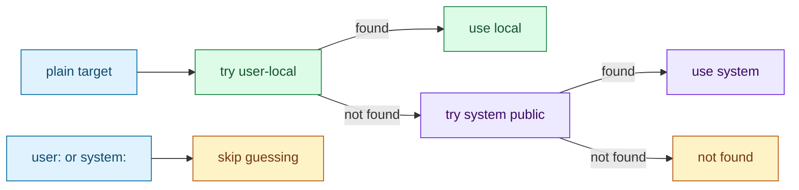
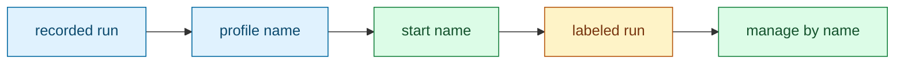
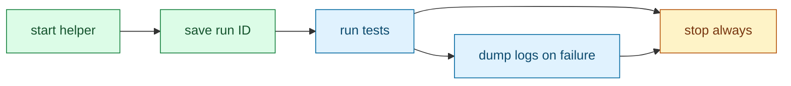

# On Hold quickstart

[Docs index](index.md) | [Technical reference loop](index.md#technical-reference-loop) | [Using On Hold in CI](ci.md)

This is the outer onboarding loop. Read it straight through to understand the product workflow without being pulled into internals. At the end of each step, keep reading for the next step or open the matching deep dive.

## Step 1: Start One Thing

On Hold starts a command so it can outlive the shell or CI step that launched it. You get a short run ID, a log, and a durable record On Hold can use later.

Action:

```bash
run_id="$(hold ./your-server --port 9000)"
```

Expect:

- stdout contains only the run ID, so scripts can capture it.
- stderr shows the command, log path, tail command, and stop command.
- the child keeps running after the launching shell exits.



On Hold is doing the process bookkeeping for you: session isolation, log capture, durable identity, and a safe cleanup handle.

Next: Step 2 shows how to inspect, stop, and prune the run you just created.

Dig deeper: [Launcher](launcher.md) explains how the child starts; [Store](store.md) explains where the run ID, log, and record live.

## Step 2: Manage It Later

Once you have a run ID or profile, On Hold can read logs, follow output, attach a console when available, stop the process group, or remove finished state.

Action:

```bash
hold tail "$run_id"
hold dump "$run_id"
hold console "$run_id"   # only for runs started with --console
hold stop "$run_id"
hold prune "$run_id"
```

Expect:

- `tail` follows the saved log.
- `dump` prints the saved log and exits.
- `console` attaches to a PTY-backed interactive run. Press `Ctrl-P Ctrl-Q` to detach without stopping it; `Ctrl-C` is sent to the attached process.
- `stop` validates the recorded process identity before signaling.
- `prune` removes state for finished or safe-to-remove runs.



The important promise is that On Hold does not blindly send a signal to whatever process currently has a PID. It checks the stored identity first and refuses when the evidence is stale or unknown.

Next: Step 3 explains how On Hold decides whether a command is user-local, system-managed, or a management action.

Dig deeper: [Identity and validation](identity.md) explains the safety checks; [CLI contract](cli-contract.md) explains commands, stdout/stderr, and exit codes; [Console](console.md) explains attachable PTY runs.

## Step 3: Understand Automatic Choices

On Hold chooses user-local or root-managed behavior from how it was invoked. Most commands are user-local. `--system` and `sudo hold ...` use system-managed state.

Action:

```bash
hold ./server                 # user-local run
hold --system ./server        # root-managed run
sudo hold ./server            # root-managed run
hold stop api                 # manage target named api
hold -- ./stop                # start a command named ./stop
```

Expect:

- plain starts use your user-local store.
- `--system` chooses the system store for a new run.
- `sudo hold ...` starts or manages system-owned state.
- `--` tells On Hold the next token is the child command, even if it looks like a On Hold command.



This automatic choice keeps the common path short while making privileged state explicit.

Next: Step 4 shows how to make targeting deterministic when names or IDs could overlap.

Dig deeper: [CLI contract](cli-contract.md) explains parsing; [Security](security.md) explains root/system invocation.

## Step 4: Make Targeting Deterministic

In multiuser systems, names can overlap. Your local profile might be named the same as a system profile, or a local run ID prefix might overlap with a public system run ID. For normal users, plain targets try user-local state first, then system public state.

Action:

```bash
hold stop web
hold stop user:web
hold stop system:web
hold dump user:7f3c2a9dcafe
hold tail system:7f3c2a9dcafe
```

Expect:

- `hold stop web` uses the default lookup order.
- `user:web` never targets system state.
- `system:web` never targets user-local state.
- system targets may self-elevate through sudo when private root authority is needed.



Use `user:` and `system:` when you want the tool to do exactly what you said instead of applying the normal local-first lookup rule.

Next: Step 5 turns a recorded run into a reusable profile.

Dig deeper: [Target resolution](target-resolution.md) explains IDs, prefixes, profiles, `user:`, `system:`, ambiguity, and `--all`.

## Step 5: Create a Profile

Profiles turn a recorded command into a reusable name. Start the command once, save the recorded run as a profile, then use the name for future starts and management.

Action:

```bash
id="$(hold ./your-server --port 9000)"
hold profile save "$id" as web
hold start web
hold stop web
```

Expect:

- user-local profiles store a private launch recipe.
- system profiles publish only public profile metadata while root keeps the recipe private.
- runs started through a profile are labeled with that profile.
- `start web` refuses by default if `web` is already running; use `--multi` when multiple copies are intentional.



Profiles are how On Hold turns an ephemeral run into a repeatable workflow without becoming a full service manager.

Next: Step 6 shows how root can delegate one registered tool without granting broad root access.

Dig deeper: [Profiles and storage aliases](profiles-and-aliases.md) explains user recipes, system profile hashes, profile matching, `--multi`, and `--all`.

## Step 6: Delegate One Root-Managed Tool

Root can set up one tool and let another user manage only that registered tool, without giving that user broad root access.

Action:

```bash
sudo hold --system /usr/bin/redis-server /etc/redis.conf
sudo hold profile save <run-id> as cache
sudo hold grant cache alice start,stop,tail,dump
```

`grant` writes managed sudoers policy, so On Hold intentionally refuses unless it resolves itself to a secured installed executable: a regular root-owned file, not group/world writable, with no whitespace in its path. A source-tree or temporary demo binary can still show starts, profiles, stops, dumps, and pruning, but not sudoers entry creation.

Then Alice can run:

```bash
hold stop system:cache
hold dump system:cache
```

Expect:

- the grant is scoped to one profile and one protected profile hash.
- only selected actions are granted.
- root On Hold rechecks private authority after sudo before acting.
- Alice does not receive a general root shell.

```mermaid
flowchart LR
    Root["root registers tool"] --> Profile["root profile"]
    Profile --> Grant["grant selected actions"]
    Grant --> User["user runs system:profile"]
    User --> Verify["root re-verifies"]
    Verify --> Action["authorized action only"]

    classDef root fill:#ede9fe,stroke:#6d28d9,color:#3b0764
    classDef user fill:#e0f2fe,stroke:#0369a1,color:#0c4a6e
    classDef safe fill:#dcfce7,stroke:#15803d,color:#14532d
    class Root,Profile,Grant root
    class User user
    class Verify,Action safe
```



This is the pattern for giving a user operational control over one root-managed helper without handing them the rest of the machine.

Next: Step 7 shows how to use the same run ID contract in CI.

Dig deeper: [Security and privilege boundaries](security.md) explains sudo self-elevation, capability argv, and managed sudoers files.

## Step 7: Use It In CI

On Hold is useful when a CI workflow needs a helper process to survive one step and be cleaned up in another.

Action:

```yaml
- name: Start helper
  run: |
    run_id="$(./hold ./your-server --port 9000)"
    echo "HELPER_RUN_ID=$run_id" >> "$GITHUB_ENV"

- name: Run tests
  run: ./run-tests

- name: Stop helper
  if: always()
  run: ./hold stop "$HELPER_RUN_ID"
```

Expect:

- later steps can reuse the captured run ID.
- failure handling can dump the helper log.
- cleanup can stop the whole recorded process group.



This is the smallest useful CI shape: start, save the ID, run work, dump logs on failure, stop on exit.

Finish: [Back to documentation index](index.md)

Dig deeper: [Using On Hold in CI](ci.md) has copyable recipes; [CLI contract](cli-contract.md) explains script-safe output and exit codes.

## Continue

[Back to docs index](index.md) | [Top](#hold-quickstart) | [Technical reference loop](index.md#technical-reference-loop) | [Using On Hold in CI](ci.md)
