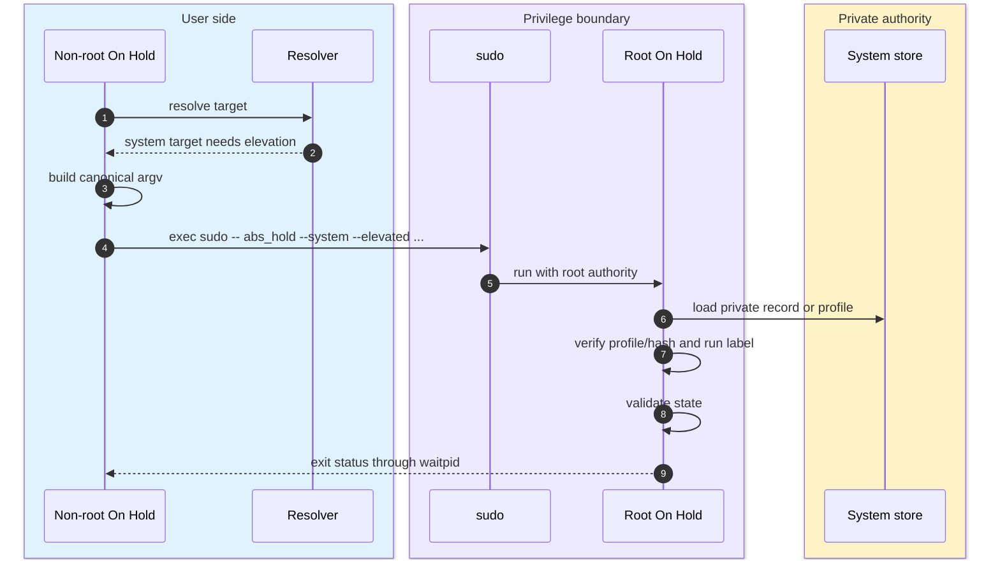
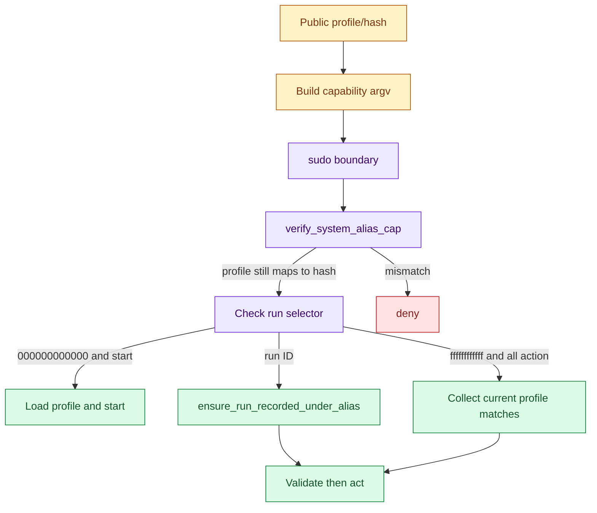
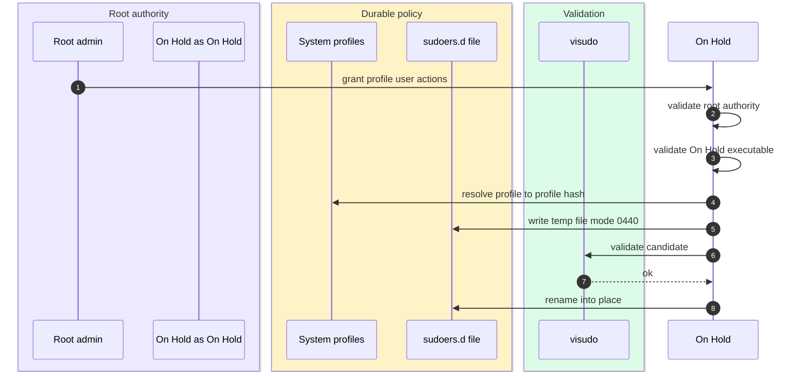

# Security and privilege boundaries

[Docs index](index.md) | [Quickstart](quickstart.md) | [Previous: Profiles and storage aliases](profiles-and-aliases.md) | [Next: Console](console.md) | Related: [Target resolution](target-resolution.md), [Store](store.md)

Outer loop bridge: deep dive for quickstart Step 3, Understand Automatic Choices, and Step 6, Delegate One Root-Managed Tool.

On Hold's root-aware behavior is built around two user-visible rules: normal runs stay user-local unless root/system authority is requested, and privileged actions are re-validated after crossing sudo. A normal user can see that a root-managed run exists without seeing its private command, log path, or process identity.

There is no daemon and no shell command payload. When On Hold needs sudo, it re-execs itself with a controlled argv shape and then rechecks private root state before acting.

## Invocation context

`detect_invocation` records whether the effective UID is root, whether `--system` was requested, whether the internal `--elevated` flag is present, and whether sudo provenance is available from `SUDO_UID`, `SUDO_GID`, and `SUDO_USER`.

When root was reached through sudo, On Hold resolves the invoking user's home directory from the user database. In test builds, `HOLD_TEST_INVOKING_HOME` can override that path. Root-managed records include `invoked_by_uid`, `invoked_by_gid`, `invoked_by_user`, and `invoked_via_sudo` in the private record only.

`--elevated` is internal. If it appears without root authority, `main` exits with an internal error.

## Sudo self-elevation



Before invoking sudo, `resolve_self_executable_path` finds the current On Hold executable through `/proc/self/exe` on Linux, `_NSGetExecutablePath` plus `realpath` on macOS, or `realpath(argv[0])` when `argv[0]` includes a slash. If the path cannot be determined, elevation fails before running sudo.

`elevate_with_sudo_canonical` forks and execs `sudo` with an argv array. It does not use a shell. It waits for sudo/root-On Hold and returns that exit status. The child inherits stdin, stdout, and stderr, so sudo prompts, diagnostics, streamed logs, and Ctrl-C behavior remain attached to the user's terminal.

## Capability argv



Root-managed profile capabilities use three argv fields:

```text
<runid_sel> <profile> <hash>
```

`000000000000` is valid only for `start`. `ffffffffffff` is valid only for approved `--all` actions. Concrete run IDs must still be recorded under the supplied profile. `cmd_elevated_capability_action` verifies the profile/hash pair first, then checks the selector rules, then loads records or profiles from the private system store.

This second verification is essential because public data was read before the sudo boundary. The profile mapping could have changed between non-root resolution and root execution.

## Managed sudoers



`grant` and `revoke` require root authority. `validate_hold_self_for_sudoers` refuses to manage grants unless the resolved On Hold executable is a regular root-owned file with group/world writes disabled and no whitespace in the path.

Managed files are written under `/etc/sudoers.d` in production, or `HOLD_TEST_SUDOERS_DIR` in test builds. `write_sudoers_template_file` writes a temp candidate with mode `0440`, validates it with `visudo -cf`, and renames it into place. The sudoers command grants only canonical root On Hold invocations with `--system --elevated`, selected verbs, one profile, one profile hash, and one 12-hex run selector slot.

## Why this design works

The sudo boundary is narrow and argv-based. On Hold never asks sudo to run an interpreted shell string, and root On Hold never trusts the public pre-sudo selection by itself. That keeps privilege crossing compatible with the validate-before-signal model: root authority is used only after the target has been re-bound to private state and re-validated.

The single-binary constraint also explains managed sudoers. There is no daemon authorization API to query, so the durable authorization object is a sudoers file whose command pattern points back to the same On Hold executable and a fixed profile hash.

## Implementation map

For maintainers, the primary functions are `detect_invocation`, `resolve_self_executable_path`, `elevate_with_sudo_canonical`, `elevate_with_sudo_parsed`, `elevate_with_sudo_targets`, `elevate_start_token`, `verify_system_alias_cap`, `ensure_run_recorded_under_alias`, `cmd_elevated_capability_action`, `validate_hold_self_for_sudoers`, `build_sudoers_line`, `write_sudoers_template_file`, `unlink_sudoers_template_file`, and `cmd_grant_revoke_action`.

## Continue

[Resume after Step 3: Step 4](quickstart.md#step-4-make-targeting-deterministic) | [Resume after Step 6: Step 7](quickstart.md#step-7-use-it-in-ci) | [Back to docs index](index.md) | [Top](#security-and-privilege-boundaries) | [Next: Console](console.md) | Branch to: [Target resolution](target-resolution.md), [Profiles and storage aliases](profiles-and-aliases.md), [Store](store.md)
