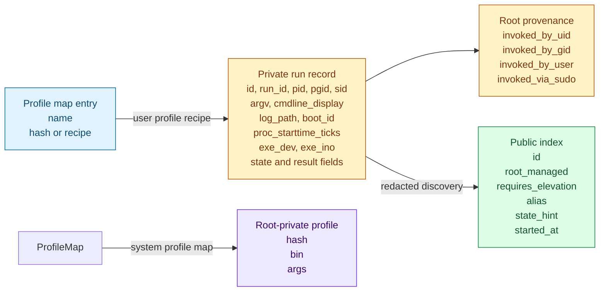
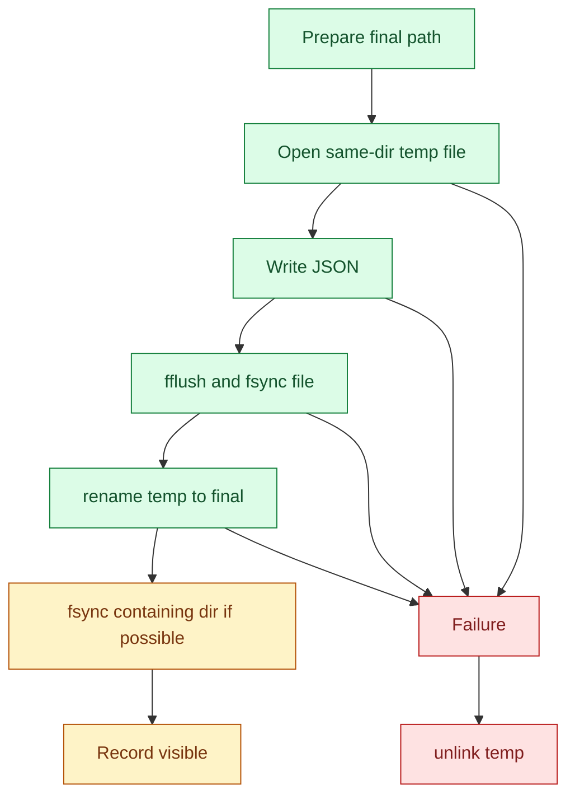

# Store

[Docs index](index.md) | [Quickstart](quickstart.md) | [Previous: Launcher](launcher.md) | [Next: Identity](identity.md) | Related: [Profiles and storage aliases](profiles-and-aliases.md), [Security](security.md)

Outer loop bridge: deep dive for quickstart Step 1, Start One Thing.

The store is where On Hold puts the facts users rely on later: run IDs, logs, profiles, root-public discovery hints, and optional console sockets. If `hold tail <id>` or `hold stop <id>` works after the original shell is gone, it is because this state survived on disk.

On Hold has two stores: a user-local store for normal starts and a system-managed store for root, sudo, and `--system` starts.

The store is the replacement for a daemon's memory. Every future command has to recover intent from files, then validate live process state separately.

## Layouts

User-local state lives under:

```text
~/.local/state/hold
```

The user store uses the base directory for run records, logs, `profiles.json`, `aliases.json`, and a `console/` subdirectory. `ensure_user_store_for_current_user` creates the base and console directory as `0700`.

System-managed state lives under:

```text
Linux: /var/lib/hold
macOS: /var/db/hold
```

In test builds, `HOLD_TEST_SYSTEM_STATE_DIR` can override that path. The production code does not take an arbitrary environment override for the system store.

```text
<system>/
  runs/
  logs/
  console/
  profiles.json
  public/
    <id>.json
    aliases.json
```

The system base and public directory are `0755`; private root records, logs, console sockets, and profiles are under `0700` directories or `0600` files. Public index files and public profile maps are `0644` discovery metadata.

## Persisted records



`write_record_atomic` writes one private JSON record per run. Required identity fields include `id`, `run_id`, `pid`, `pgid`, `sid`, `start_unix_ns`, `argv`, `uid`, `gid`, `proc_starttime_ticks`, `exe_dev`, and `exe_ino`. The recorded `argv[0]` is the resolved executable path, even when the user launched a relative path such as `../bin/daemon`; profiles later reuse that absolute recipe. Optional fields are written only when the corresponding `has_*` flag is set, including `alias`, `console_sock`, `started_at`, `ended_at`, `state`, `exit_code`, `term_signal`, `launch_error`, `log_path`, `boot_id`, and root invocation provenance.

`write_public_index_atomic` writes a redacted system discovery projection in the native schema: `id`, `root_managed`, optional `name`, `state_hint`, timestamps (`started_at`/`created_at`/`ended_at`), `observed_ports`, `exit_code`, `pid`/`pgid`/`sid`, and `running`. It never writes argv, command display, log paths, console socket paths, boot ID, executable identity, sudo provenance, or environment.

## Atomic writes



Private run records are written as `.<id>.tmp` and renamed to `<id>.json`. Public index records use the same pattern in the public directory. Profile files and internal profile-map files are also written through temp files and atomic rename, then the containing directory is fsynced where the code can do so.

This pattern matters because On Hold has no daemon to reconstruct partially written state. If a process is recorded, future actions must be able to trust that the record is syntactically complete enough to load and evaluate.

## Public and private authority

Private records are authoritative. Public root indexes exist so normal users can discover that a root-managed run exists and decide whether an action should self-elevate. Normal list output reads both the user-local private store and the system public index, while root/system list reads private system records.

Public root rows carry the latest projected `state_hint` and lifecycle fields written by Hold. New runs use Hold-owned supervisor/reaper paths to project final exit state when the child exits. The private record remains authoritative: root actions re-load private state and evaluate live process identity before signaling or pruning.

## Pruning

Pruning is storage cleanup plus safety. `prune_one_run` removes records only when the evaluated state is exited, failed, stale, or otherwise allowed by the caller. Running valid runs are not pruned. Root-managed public index files and console sockets are removed with the corresponding private record when possible, and `cmd_prune_store_all` also clears orphaned logs and console sockets.

## Why this design works

The store makes a daemonless process manager possible: every command can rediscover known runs from disk. The split between public discovery and private authority preserves root confidentiality while still allowing normal users to target root-managed runs through a controlled sudo boundary. Atomic writes prevent half-records from becoming false authority for later validate-before-signal decisions.

## Implementation map

For maintainers, the primary functions and structs are `struct store_paths`, `struct record`, `struct public_index`, `init_user_store_from_home`, `ensure_user_store_for_current_user`, `init_system_store`, `ensure_system_store`, `write_record_atomic`, `write_public_index_atomic`, `load_record`, `load_public_index`, `prune_one_run`, and `cmd_prune_store_all`.

## Continue

[Resume quickstart after Step 1: Step 2](quickstart.md#step-2-manage-it-later) | [Back to docs index](index.md) | [Top](#store) | [Next: Identity](identity.md) | Branch to: [Profiles and storage aliases](profiles-and-aliases.md), [Security](security.md)
