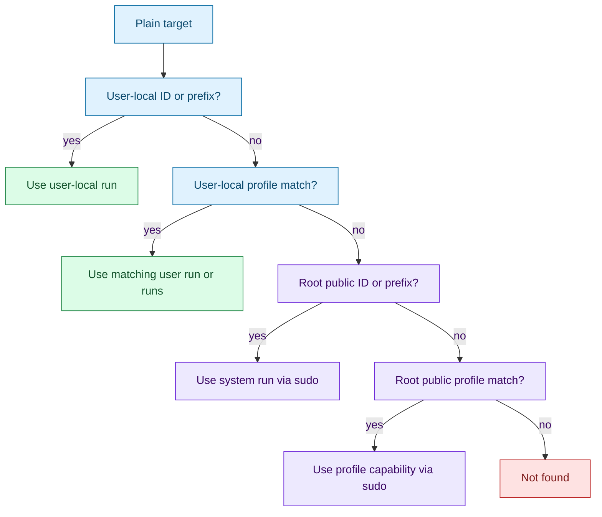
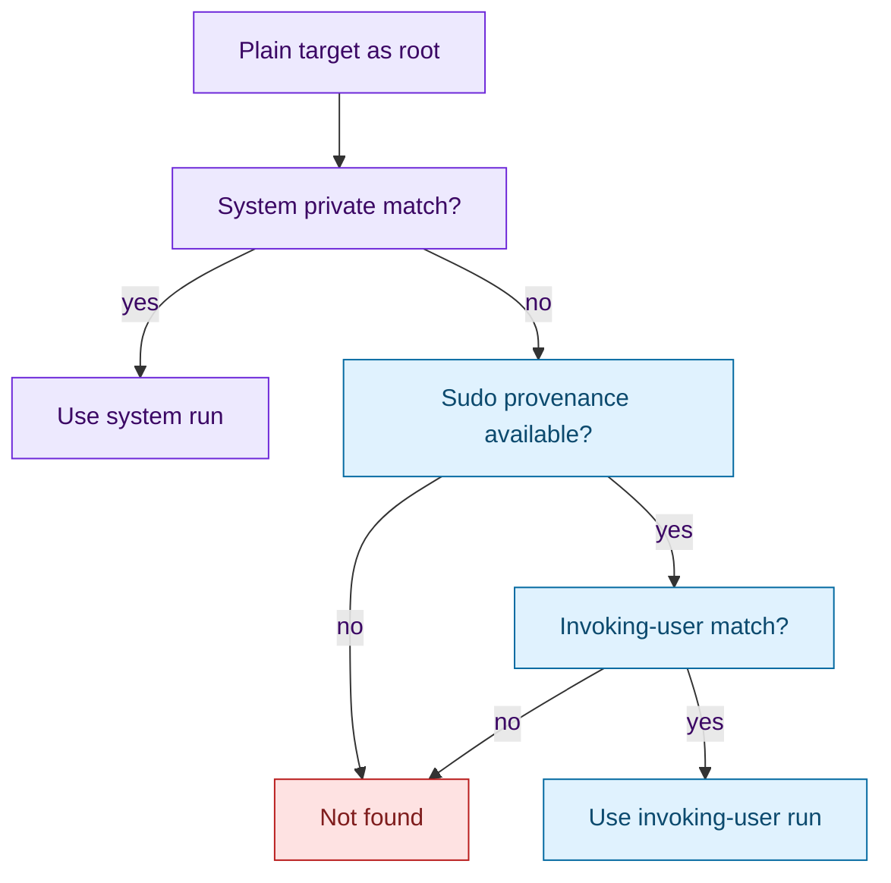

# Target resolution

[Docs index](index.md) | [Quickstart](quickstart.md) | [Previous: Identity](identity.md) | [Next: Profiles and storage aliases](profiles-and-aliases.md) | Related: [Security](security.md), [CLI contract](cli-contract.md)

Outer loop bridge: deep dive for quickstart Step 4, Make Targeting Deterministic.

Target resolution answers one user-facing question: when you type `hold stop web`, `hold tail 7f3`, or `hold dump system:api`, which concrete run did you mean? It does not decide whether the process is safe to signal; that is the identity validator's job.

The resolver is split because On Hold has several addressing forms and two authority contexts. `resolve_target` is used for profile creation, while `resolve_action_token` is used for action commands that may expand one profile into multiple concrete targets.

## Accepted target forms

Targets for actions may be:

- A full 12-character run ID.
- A leading run ID prefix.
- A profile name.
- `user:<target>` to force user-local lookup.
- `system:<target>` to force system-managed lookup.

`valid_id`, `valid_id_prefix`, and `valid_alias` enforce the lexical rules. Profile names are 1 to 64 characters, use alphanumeric characters plus `_` and `-`, and cannot be full profile hashes. `valid_alias` remains the internal validator name.

## Non-root plain resolution

For normal users, user-local matches win over root-public matches. This is deliberate: a local token should not unexpectedly cross a privilege boundary merely because the same prefix or profile is visible in the system public index.

`user:<target>` disables system lookup. `system:<target>` disables user lookup and may require sudo self-elevation.

## Root and sudo resolution

Root reads private system records directly. When root was reached through sudo and the token does not match a root-managed run, On Hold can resolve against the invoking user's local store. Direct root without sudo provenance has no invoking user context and cannot resolve `user:<target>`.

## Profile intent

Profiles are filtered by command because the same profile label can be attached to several past or current runs.

| Command | Profile candidates |
| --- | --- |
| `start` | Running profile-labeled runs, used to enforce the no-duplicate default. |
| `stop` | Running profile-labeled runs. |
| `kill` | Running profile-labeled runs. |
| `tail` | Running profile-labeled runs. |
| `console` | Running profile-labeled runs that have `console_sock`. |
| `dump` | Profile-labeled runs that have logs. |
| `prune` | Profile-labeled past runs that are exited, failed, or stale. |

`record_matches_alias_intent` is the source of this table. If a known profile has no applicable candidate for an action, On Hold treats that as a successful no-op. If a profile has multiple candidates, it exits 6 and prints candidates unless the command supports `--all` and `--all` was supplied. `--all` applies only to `stop`, `kill`, and `prune`.

## Public profile capabilities

A normal user cannot read root-private records, so root-managed profile actions begin with public data. `append_public_alias_elevation_target` uses public profile metadata and public index files to build either:

- a concrete run selector plus profile/hash capability, or
- the `ffffffffffff` selector for approved multi-target `--all` actions.

Root On Hold later verifies that the profile still maps to the supplied hash and that concrete run selectors are recorded under that profile. The public side selects intent; the root side rechecks authority.

## Why this design works

The resolver is conservative about authority. It avoids surprising privilege escalation, returns concrete store/run pairs before acting, and lets root re-validate capability data after crossing sudo. That supports the validate-before-signal model because signal code receives a resolved private record path, not an ambiguous user token.

The daemonless constraint also shapes ambiguity behavior. Without a daemon to arbitrate a "current" profile run, On Hold must either identify one candidate, apply an explicit `--all`, or refuse with candidates.

## Implementation map

For maintainers, the primary functions and structs are `parse_id_token`, `valid_target_atom`, `resolve_target`, `resolve_action_token`, `append_private_alias_targets`, `append_public_alias_elevation_target`, `collect_private_alias_matches`, `collect_public_alias_matches`, `record_matches_alias_intent`, `report_alias_ambiguity`, and `struct resolved_target`.

## Continue

[Resume quickstart after Step 4: Step 5](quickstart.md#step-5-create-a-profile) | [Back to docs index](index.md) | [Top](#target-resolution) | [Next: Profiles and storage aliases](profiles-and-aliases.md) | Branch to: [Security](security.md), [CLI contract](cli-contract.md)
